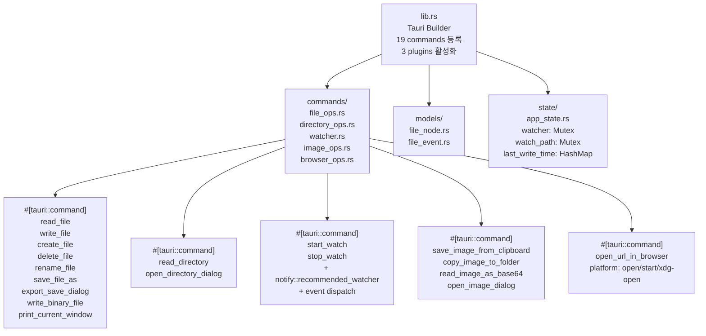

# Backend 아키텍처 - MdEdit v0.4.0

> **Last Updated**: 2026-05-14 | **Version**: 0.4.0
> **Runtime**: Tauri 2 + Rust 1.77.2 (edition 2021)

## Rust 모듈 구조



## IPC 커맨드 카탈로그

### 파일 작업 (file_ops.rs) - SPEC-FS-001

| 커맨드 | 입력 | 출력 | 보안 | 호출처 |
|--------|------|------|------|--------|
| **read_file** | path: String | Result<String> | validate_path (.. 검사) | MarkdownEditor, useFileSystem |
| **write_file** | path, content | Result<()> | validate_path | AppLayout.handleSave, useFileSystem |
| **create_file** | path, initialContent | Result<()> | validate_path | FileExplorer (새 파일) |
| **delete_file** | path | Result<()> | validate_path | FileTree (파일 삭제) |
| **rename_file** | oldPath, newPath | Result<()> | 양쪽 validate_path | FileTreeNode (이름 변경) |
| **save_file_as** | content, defaultDir | Result<String \| null> | 네이티브 dialog | AppLayout.handleSaveAs |
| **export_save_dialog** | format: 'html'\|'pdf'\|'docx' | Result<String> | 네이티브 dialog | exportHtml, exportPdf, exportDocx |
| **write_binary_file** | path, base64Data | Result<()> | validate_path | exportDocx (DOCX 바이너리) |
| **print_current_window** | — | Result<()> | 네이티브 print dialog | exportPdf (Tauri native) |

### 디렉토리 작업 (directory_ops.rs) - SPEC-FS-001, SPEC-PREVIEW-004

| 커맨드 | 입력 | 출력 | 호출처 | 추가 (v0.5.0) |
|--------|------|------|--------|-------------|
| **read_directory** | path: String | Result<FileNode[]> | FileExplorer.tsx (초기화, 폴더 열기) | - |
| **open_directory_dialog** | — | Result<String \| null> | FileExplorer "폴더 열기" 버튼 | - |
| **register_asset_scope** | folder_path: String | Result<()> | openFolder, openFolderPath에서 호출 | **NEW (v0.5.0)** |

**v0.5.0 신규 커맨드**: 
- register_asset_scope: 폴더를 열 때마다 asset 프로토콜 scope 객체에 `allow_directory(canonicalized_path, recursive=true)` 등록. 경로 정규화(절대 경로화 + 심링크 해소) 수행. SPEC-PREVIEW-004의 런타임 scope 등록 메커니즘 구현.

### 파일 감시 (watcher.rs) - SPEC-FS-002

| 커맨드 | 입력 | 출력 | 메커니즘 | 호출처 |
|--------|------|------|----------|--------|
| **start_watch** | path: String | Result<()> | notify::recommended_watcher 생성 → emit('file-changed') | App.tsx (useFileWatcher) |
| **stop_watch** | — | Result<()> | watcher cleanup | App.tsx (언마운트 또는 폴더 변경) |

**주요 기능**:
- 50ms 디바운스 (last_write_time HashMap)
- ignore 패턴: .tmp, .swp, .git/, .DS_Store, Thumbs.db, node_modules/
- 경로 정규화 (\ → /)
- FileChangeKind: Created | Modified | Deleted | Renamed

### 이미지 작업 (image_ops.rs) - SPEC-IMG-001, SPEC-IMG-MODE-001

| 커맨드 | 입력 | 출력 | 호출처 |
|--------|------|------|--------|
| **save_image_from_clipboard** | destFolder, filename | Result<String> | imageHandler.ts (클립보드 → 파일) |
| **copy_image_to_folder** | sourcePath, destFolder | Result<String> | imageHandler.ts (드래그 → 파일) |
| **read_image_as_base64** | imagePath | Result<String> | imageHandler.ts (inline-blob 모드) |
| **open_image_dialog** | — | Result<String \| null> | EditorToolbar (dialog로 선택) |

### 브라우저 작업 (browser_ops.rs) - SPEC-PREVIEW-001

| 커맨드 | 입력 | 출력 | 호출처 |
|--------|------|------|--------|
| **open_url_in_browser** | url: String | Result<()> | MarkdownPreview (링크 클릭) |

플랫폼별: macOS `open`, Windows `start`, Linux `xdg-open`

## AppState (state/app_state.rs)

**구조**:
```rust
pub struct AppState {
    /// 현재 활성 파일 감시기 (Mutex로 보호)
    pub watcher: Mutex<Option<RecommendedWatcher>>,
    
    /// 현재 감시 중인 경로 (Mutex로 보호)
    pub watch_path: Mutex<Option<String>>,
    
    /// 파일별 마지막 쓰기 시간 (50ms 디바운스용)
    /// HashMap<path, Instant>
    pub last_write_time: Mutex<HashMap<String, Instant>>,
}
```

**특징**:
- **Thread-safe**: 모든 필드가 Mutex로 감싸짐
- **Debounce**: 같은 파일에 대해 50ms 이내 이벤트 무시
- **Cross-command**: start_watch → stop_watch 순서 강제

**사용처**:
- start_watch: 기존 watcher 정리 후 새로 생성
- file-changed 이벤트: debounce 체크 후 emit

## 모델 (models/)

### FileNode (file_node.rs)
```rust
pub struct FileNode {
    pub name: String,
    pub path: String,
    pub isDirectory: bool,
    #[serde(skip_serializing_if = "Option::is_none")]
    pub children: Option<Vec<FileNode>>,
}
```

**특징**:
- 재귀적 구조 (폴더 → 자식 파일/폴더)
- JSON 직렬화 (serde)
- Frontend FileNode 타입과 1:1 매칭

### FileChangedEvent (file_event.rs)
```rust
pub struct FileChangedEvent {
    pub kind: FileChangeKind,
    pub path: String,
    pub timestamp: u64,  // Unix ms
}

pub enum FileChangeKind {
    Created,
    Modified,
    Deleted,
    Renamed,
}
```

**특징**:
- Tauri Emitter로 'file-changed' 이벤트 발생
- Frontend useFileWatcher가 구독

## Tauri 플러그인

| 플러그인 | 버전 | 용도 |
|---------|------|------|
| **tauri-plugin-opener** | 2 | 파일/URL 네이티브 열기 |
| **tauri-plugin-shell** | 2 | 외부 커맨드 실행 (현재 미사용, 향후 용도) |
| **tauri-plugin-dialog** | 2 | 파일/폴더 선택 dialog, 저장 dialog |

**활성화** (lib.rs):
```rust
tauri::Builder::default()
    .plugin(tauri_plugin_opener::init())
    .plugin(tauri_plugin_shell::init())
    .plugin(tauri_plugin_dialog::init())
    // ...
    .run(tauri::generate_context!())
```

## 릴리스 프로파일 최적화

**Cargo.toml [profile.release]**:
```toml
panic = "abort"      # 스택 unwinding 없음 → 더 작은 바이너리
codegen-units = 1    # 단일 패스 컴파일 → 최적화 극대화
lto = true          # Link-Time Optimization → 더 빠른 실행
opt-level = "s"     # 크기 최적화 (-Os) → 더 작은 크기
strip = true        # 심볼 제거 → 더 작은 파일
```

**영향**:
- 바이너리 크기: ~15-20MB → ~5-10MB (iOS/macOS signing 용이)
- 시작 시간: ~100ms
- 메모리: 기본 5-10MB

## @MX Tag 어노테이션

| 태그 | 위치 | 의미 |
|------|------|------|
| @MX:ANCHOR | file_ops.rs validate_path | fan_in >= 5 (모든 명령이 호출) |
| @MX:ANCHOR | watcher.rs start_watch | 파일 감시 제어 진입점 |
| @MX:WARN | watcher.rs start_watch | 스레드 관리 (notify watcher 콜백 별도 OS 스레드) |
| @MX:NOTE | watcher.rs should_ignore_path | 이그노어 패턴 |

## 테스트 (src-tauri/tests/)

**주요 테스트 모듈**:
- `tests/file_ops.rs` — read_file, write_file, validate_path
- `tests/watcher.rs` — should_ignore_path, event dispatch
- `tests/app_state.rs` — debounce, state mutation

**테스트 실행**:
```bash
cd src-tauri
cargo test --lib
cargo test --test '*'  # 통합 테스트
```

**커버리지 목표**: >= 85%

---

**v0.4.0 변경점**:
- scripts/prebuild.mjs 외부화로 cargo clean 수동화
- SKIP_CARGO_CLEAN=1 환경 변수로 우회 가능
- Windows production build 안정화
