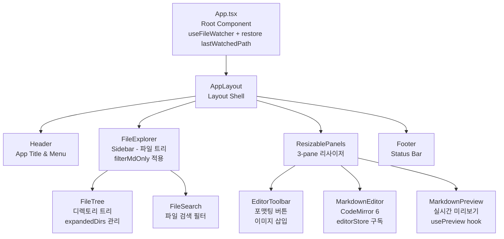

# Frontend 아키텍처 - MdEdit v0.4.0

> **Last Updated**: 2026-05-14 | **Version**: 0.4.0
> **Framework**: React 18.3.1 + TypeScript 5.5 + Zustand 5.0.0

## 컴포넌트 트리



## 컴포넌트 카탈로그

### Layout 계층 (src/components/layout/)

| 파일 | 책임 | 사용 Store | 사용 Hook |
|------|------|-----------|----------|
| **AppLayout.tsx** | 메인 레이아웃 오케스트레이션 (Header/Sidebar/Editor/Preview/Footer) | editorStore, fileStore, uiStore | useTheme, useScrollSync |
| **Header.tsx** | 제목, 메뉴 (Save/Export/Open), 더러운 상태 표시 | editorStore, uiStore | - |
| **Footer.tsx** | 상태바 (커서 위치, 스크롤 싱크 토글, 이미지 삽입 모드) | editorStore, uiStore | - |
| **ResizablePanels.tsx** | 3-pane 리사이저 (sidebarWidth, previewWidth 저장) | uiStore | - |

### Sidebar 계층 (src/components/sidebar/)

| 파일 | 책임 | 사용 Store | 사용 Hook | 변경점 (v0.4.0) |
|------|------|-----------|----------|----------------|
| **FileExplorer.tsx** | 최상위 컨테이너, 폴더 열기, 검색 | fileStore, uiStore | useFileSystem | **filterMdOnly → filterViewableFiles 확장 (v0.5.0)** |
| **FileTree.tsx** | 재귀적 디렉토리 트리 (expandedDirs 관리) | fileStore | - | - |
| **FileTreeNode.tsx** | 단일 노드 렌더링 (폴더/파일, 클릭 핸들러) | fileStore | - | - |
| **FileSearch.tsx** | 검색 입력 필터 (filterTree 호출) | fileStore | - | - |

**v0.4.0 신규 필터**: filterMdOnly(nodes) — 모든 .md 파일과 ancestor 디렉토리만 포함. README, 설정 파일 제외 가능.

### Editor 계층 (src/components/editor/)

| 파일 | 책임 | 사용 Store | 사용 Hook |
|------|------|-----------|----------|
| **MarkdownEditor.tsx** | CodeMirror 6 에디터 (content 바인딩, dirty 추적) | editorStore | - |
| **EditorToolbar.tsx** | 포맷팅 버튼 (Bold, Italic, Link, Code, List) | editorStore, uiStore | insertImageFromDialog |
| **extensions/markdown-extensions.ts** | 커스텀 마크다운 완성 (헤더, 링크, 목록) | - | - |
| **extensions/keyboard-shortcuts.ts** | Cmd/Ctrl+B/I, Tab/Shift+Tab 구현 | - | - |
| **extensions/syntax-highlighting.ts** | CodeMirror 구문 강조 theme | - | - |
| **extensions/image-widget.ts** | 인라인 이미지 위젯 (inline-blob 미리보기) | - | - |

### Preview 계층 (src/components/preview/)

| 파일 | 책임 | 사용 Hook | 추가 (v0.5.0) |
|------|------|-----------|---------------|
| **MarkdownPreview.tsx** | 마크다운 미리보기 컨테이너 (usePreview, useScrollSync) | usePreview, useScrollSync | - |
| **PreviewRenderer.tsx** | HTML 렌더링 + DOMPurify 안전화 | - | - |
| **HtmlFileViewer.tsx** | 독립 HTML 파일 보기 — 샌드박스 iframe 렌더링 | - | **NEW** |
| **PreviewContainer.tsx** | 파일 종류 분기 컴포넌트 (마크다운 vs HTML) | - | **NEW** |

**v0.5.0 신규 컴포넌트**: 
- HtmlFileViewer: `.html` 파일을 `sandbox="allow-scripts allow-same-origin"` iframe에 렌더링. 5MB 초과 파일 및 로드 오류 처리.
- PreviewContainer: 선택된 파일의 확장자를 보고 MarkdownPreview 또는 HtmlFileViewer 중 하나를 렌더.

## 훅 (src/hooks/)

### usePreview.ts
**목적**: 마크다운 콘텐츠를 HTML로 실시간 렌더링 (300ms 디바운스)

**호출 패턴**:
```typescript
const { html, isLoading } = usePreview();
// 내부적으로 renderMarkdown(content, highlighter, isDark) 호출
// 후처리로 embedPreviewImages로 이미지 경로 변환
```

**주요 기능**:
- editorStore.content 구독 → 300ms 디바운스 → renderMarkdown 호출
- Shiki 하이라이터 초기화 (mount 시 once)
- 에러 발생 시 이전 HTML 유지
- 다크 모드 토글 감지

### useFileSystem.ts
**목적**: Tauri IPC를 통한 파일 시스템 작업 추상화

**호출 패턴**:
```typescript
const { isLoading, error } = useFileSystem();
await readDirectory(path);      // IPC invoke
await openDirectoryDialog();    // IPC invoke
```

**주요 기능**:
- readDirectory(path) — 재귀적 파일 트리 읽기
- openDirectoryDialog() — 네이티브 폴더 선택 dialog
- readFile(path), writeFile(path, content) 래퍼
- 로딩/에러 상태 관리

### useFileWatcher.ts
**목적**: 파일 시스템 감시 (Tauri watcher 크레이트)

**호출 패턴**:
```typescript
const { isWatching, startWatch, stopWatch } = useFileWatcher({
  onFileChanged: (event: FileChangedEvent) => { /* ... */ }
});
await startWatch('/Users/user/Projects');
```

**주요 기능**:
- Tauri invoke('start_watch', { path }) 호출
- file-changed 이벤트 리스너 등록 (Tauri Emitter)
- 컴포넌트 언마운트 시 리스너 정리
- FileChangeKind: Created | Modified | Deleted | Renamed

### useTheme.ts
**목적**: dark 모드 토글 (system preference + localStorage)

**호출 패턴**:
```typescript
useTheme(); // 부작용: document.documentElement에 'dark' class 설정
```

**주요 기능**:
- uiStore.theme 구독
- document.documentElement.classList 토글
- localStorage "mdedit-ui-store"에 theme 저장
- system 선호도 감지

### useScrollSync.ts
**목적**: 에디터 ↔ 미리보기 라인 동기화

**호출 패턴**:
```typescript
useScrollSync(editorRef, previewRef, enabled);
// 에디터 스크롤 → data-line 속성 기반 preview 스크롤
// 또는 preview 스크롤 → editor 스크롤 
```

**주요 기능**:
- CodeMirror 라인 번호 → preview data-line 매칭
- throttle (50ms) 적용
- 양방향 sync (사용자 선택)

## Zustand 스토어 (src/store/)

### editorStore.ts
**상태 형태**:
```typescript
{
  content: string;
  cursorLine: number;
  cursorCol: number;
  dirty: boolean;
  currentFilePath: string | null;
}
```

**Fan-in**: >= 3 (MarkdownEditor, EditorToolbar, Footer, AppLayout)
**Persistence**: localStorage 없음 (파일 기반)
**액션**: setContent, setCursor, setDirty, setCurrentFilePath, resetEditor

### fileStore.ts
**상태 형태**:
```typescript
{
  fileTree: FileNode[];
  currentFile: string | null;
  expandedDirs: Set<string>;     // ❌ zustand v5 직렬화 불가
  watchedPath: string | null;
  isLoading: boolean;
}
```

**Fan-in**: >= 2 (FileExplorer, AppLayout)
**Persistence**: ❌ 없음 (Set<string>은 JSON 직렬화 불가)
**액션**: setFileTree, setCurrentFile, toggleExpanded, setWatchedPath, setIsLoading

### uiStore.ts
**상태 형태**:
```typescript
{
  sidebarWidth: number;           // px
  previewWidth: number;           // px
  theme: 'light' | 'dark' | 'system';
  fontSize: number;               // px
  sidebarCollapsed: boolean;
  saveStatus: 'new' | 'saving' | 'saved' | 'unsaved';
  scrollSyncEnabled: boolean;
  lastWatchedPath: string | null; // SPEC-UI-003 REQ-UI-003-06/07
  imageInsertMode: 'inline-blob' | 'file-save';
}
```

**Fan-in**: >= 3 (AppLayout, Header, Footer, ResizablePanels, ImageModeToggle)
**Persistence**: ✅ localStorage 키 "mdedit-ui-store" (persist middleware)
**액션**: setSidebarWidth, setPreviewWidth, toggleSidebar, toggleScrollSync, setSaveStatus, 등

## lib/markdown 파이프라인 (개요)

### renderMarkdown(content, highlighter, isDark, mdFilePath)
**역할**: 마크다운 → HTML 변환 (markdown-it + 플러그인 파이프라인)

**plugin 순서** (SPEC-PREVIEW-001):
1. mermaidPlugin — 코드블록 `mermaid` → 다이어그램
2. **markdownItKatex** — `$$...$$` 수식 → **KaTeX HTML** (v0.4.0 신규, SPEC-PREVIEW-003)
3. tableScrollPlugin — `<table>` → 스크롤 가능 래퍼
4. imageResolverPlugin — 이미지 경로 → Tauri asset URL
5. dataLinePlugin — 블록 요소에 data-line 속성 (scroll sync용)

**보안**:
- html: false MANDATORY (XSS 방지)
- linkify, typographer 활성화

**자세한 흐름**: [pipelines.md](./pipelines.md) 참조

## IPC 인터페이스 (lib/tauri/ipc.ts)

19개 typed 래퍼 함수:
- readFile(path) → Result<string>
- writeFile(path, content) → Result<void>
- readDirectory(path) → Result<FileNode[]>
- startWatch(path) → Result<void>
- stopWatch() → Result<void>
- saveFileAs(content, defaultDir?) → Result<string | null>
- exportSaveDialog(format: 'html'|'pdf'|'docx') → Result<string | null>
- openDirectoryDialog() → Result<string | null>
- copyImageToFolder(path, destFolder) → Result<string>
- 그 외 이미지, 브라우저 작업

**모든 함수는 Promise 기반 (async/await 호환)**

---

**v0.4.0 신규 통합**:
- src/main.tsx에 `import 'katex/dist/katex.min.css'` 추가
- FileExplorer.tsx에 filterMdOnly 필터 로직 추가
- renderer.ts에 markdownItKatex 플러그인 체인 추가
