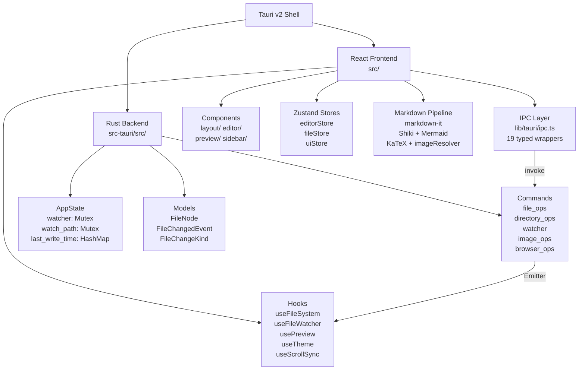

# 아키텍처 개요 - MdEdit v0.4.0

> **Last Updated**: 2026-05-14 | **Version**: 0.4.0
> **Stack**: Tauri v2 (Rust 1.77.2) + React 18.3.1 + TypeScript 5.5 + CodeMirror 6

## 프로젝트 요약

MdEdit는 크로스 플랫폼 데스크톱 마크다운 에디터입니다. Tauri v2 (Rust 백엔드) + React 18 (프론트엔드) 기반으로 구축되었습니다.

**핵심 기능:**
- **3-pane 레이아웃**: 사이드바 파일 탐색기, CodeMirror 6 에디터, 실시간 마크다운 미리보기
- **마크다운 렌더링**: markdown-it + Shiki 구문 강조 + Mermaid 다이어그램 + **KaTeX LaTeX 수식** (v0.4.0 신규)
- **내보내기**: HTML, PDF (Tauri 네이티브 print API), DOCX (docx npm 패키지)
- **파일 감시**: notify 크레이트로 외부 변경 자동 감지 (50ms 디바운스)
- **상태 관리**: Zustand (persist middleware로 localStorage 저장)
- **이미지 처리**: inline-blob (base64 data URI) 또는 file-save (./images/) 모드

**v0.4.0 신규 기능:**
1. **KaTeX LaTeX 렌더링**: @traptitech/markdown-it-katex 플러그인 통합 (SPEC-PREVIEW-003)
2. **파일 익스플로러 .md 필터**: FileExplorer.tsx에서 filterMdOnly 적용 (commit d4eed73)
3. **Windows 프로덕션 빌드 훅**: scripts/prebuild.mjs 외부화로 cargo clean 우회 가능 (SKIP_CARGO_CLEAN=1)

## 전체 아키텍처



## 상세 모듈 맵

| 모듈 | 파일 | 설명 |
|------|------|------|
| **Frontend 컴포넌트** | [frontend.md](./frontend.md) | React 컴포넌트 트리, 훅, 스토어, 라이브러리 |
| **Backend 명령** | [backend.md](./backend.md) | Rust IPC 커맨드, 상태 관리, 모듈 구조 |
| **데이터 파이프라인** | [pipelines.md](./pipelines.md) | 마크다운 렌더링, 파일 감시, 내보내기 흐름 |
| **테스트 아키텍처** | [testing.md](./testing.md) | 테스트 전략, 커버리지, 패턴 |

## 기술 스택

### Frontend
- **Framework**: React 18.3.1 (Hooks, Concurrent)
- **Editor**: CodeMirror 6 (autocomplete, lang-markdown, search, view)
- **마크다운**: markdown-it 14.1.1, Shiki 3.22.0, Mermaid 11.12.3, **KaTeX 0.16.44** (신규)
- **상태**: Zustand 5.0.0 (persist middleware)
- **CSS**: Tailwind 3.4, CSS Variables (dark mode)
- **IPC**: @tauri-apps/api 2

### Backend
- **Runtime**: Tauri 2 (Rust 1.77.2 edition 2021)
- **Async**: Tokio 1 (full features)
- **File Watch**: notify 6 (recommended_watcher)
- **Serialization**: serde 1, serde_json 1
- **Utilities**: base64 0.22
- **Plugins**: opener, shell, dialog (Tauri v2)

### Build & DevOps
- **Frontend Build**: Vite 5.4, TypeScript 5.5
- **Backend Build**: Cargo release (panic=abort, lto, opt-level=s, strip=true)
- **Prebuild Hook**: scripts/prebuild.mjs (Windows cargo clean 자동화)
- **Testing**: Vitest 2, Playwright 1.58.2, @testing-library/react

## 진입점

| 파일 | 역할 | SPEC |
|------|------|------|
| `src/main.tsx` | React 엔트리 (katex CSS import) | SPEC-UI-001 |
| `src/App.tsx` | 루트 컴포넌트 (useFileWatcher, store 복원) | SPEC-UI-002 |
| `src-tauri/src/lib.rs` | Tauri Builder (19 커맨드 등록) | SPEC-FS-001 |
| `scripts/prebuild.mjs` | Windows 프로덕션 빌드 cargo clean 훅 | v0.4.0 신규 |

## SPEC 인덱스

| SPEC ID | 제목 | 범위 |
|---------|------|------|
| SPEC-FS-001 | IPC 파일 작업 계층 | file_ops.rs, ipc.ts |
| SPEC-FS-002 | AppState & 파일 감시 | watcher.rs, useFileWatcher.ts |
| SPEC-UI-002 | fileStore 사이드바 | FileExplorer.tsx, fileStore.ts |
| SPEC-UI-003 | UI 상태 (lastWatchedPath 복원) | uiStore.ts, App.tsx |
| SPEC-EDITOR-001 | editorStore | editorStore.ts, MarkdownEditor.tsx |
| SPEC-PREVIEW-001 | 마크다운 렌더러 & 브라우저 열기 | renderer.ts, usePreview.ts |
| **SPEC-PREVIEW-003** | **KaTeX LaTeX 렌더링** (신규) | **renderer.ts, main.tsx** |
| SPEC-EXPORT-001 | exportSaveDialog & 바이너리 쓰기 | exportHtml.ts, exportPdf.ts |
| SPEC-IMG-001 | 이미지 작업 | image_ops.rs, imageHandler.ts |
| SPEC-IMG-MODE-001 | ImageInsertMode (inline-blob vs file-save) | uiStore.ts, imageHandler.ts |

## 릴리스 프로파일 (src-tauri/Cargo.toml)

```toml
[profile.release]
panic = "abort"              # 패닉 시 스택 언래핑 없음
codegen-units = 1           # 단일 프로세스 컴파일 (최적화)
lto = true                   # Link-Time Optimization
opt-level = "s"             # 크기 최적화 (s = -Os)
strip = true                # 바이너리 심볼 제거
```

---

**Legend**: 
- HARD rule: 절대 위반하지 말 것
- @MX:ANCHOR: 고 fan_in 함수 (>=3 호출자)
- @MX:WARN: 위험 영역 (goroutine, 복잡도, global state)
