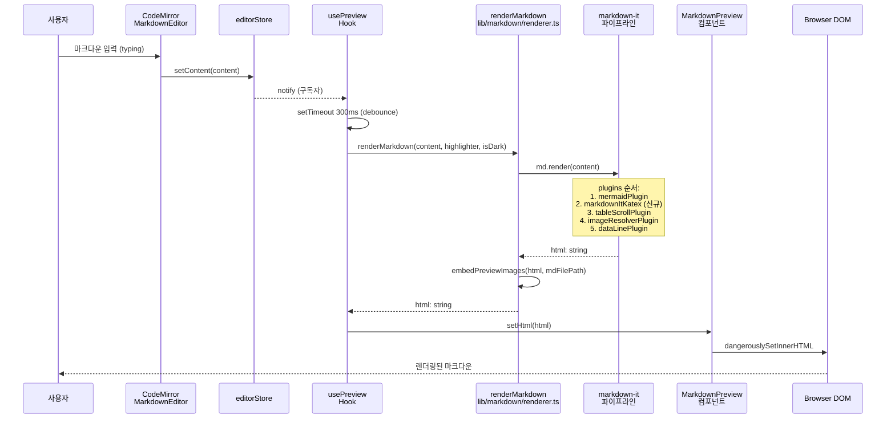
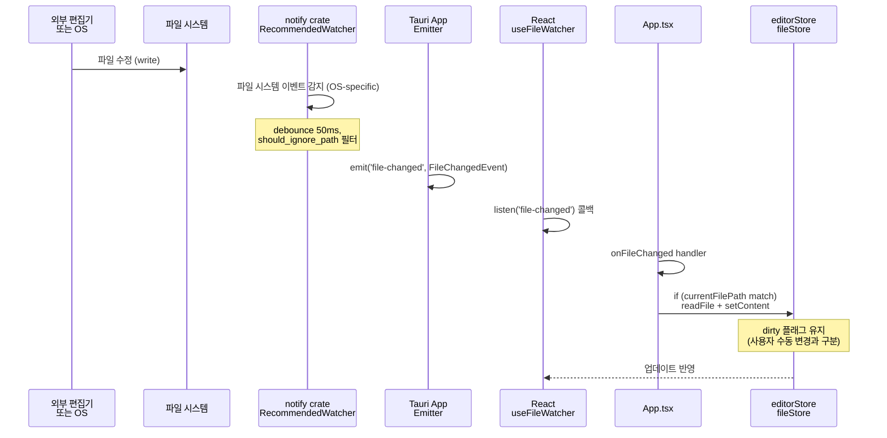
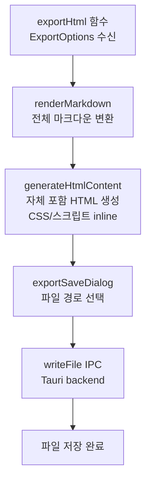
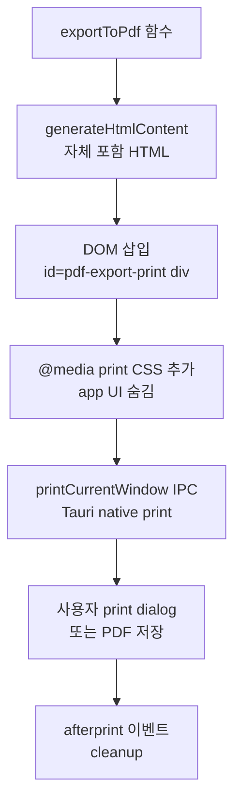
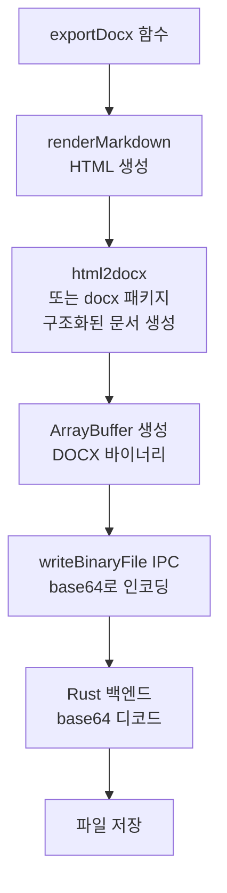
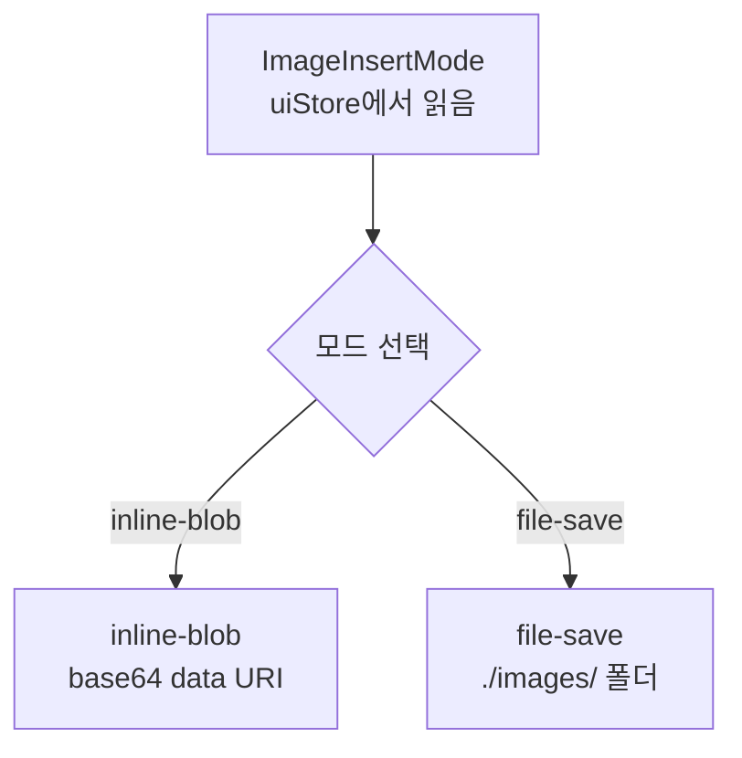
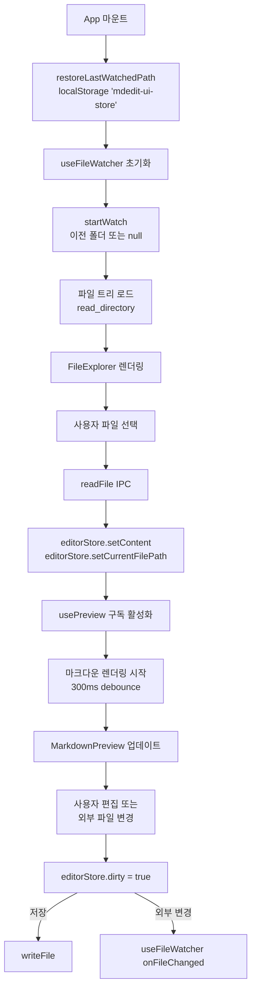

# 데이터 파이프라인 - MdEdit v0.4.0

> **Last Updated**: 2026-05-14 | **Version**: 0.4.0
> **Focus**: 마크다운 렌더링, 파일 감시, 내보내기, 이미지 처리

## 1. 마크다운 렌더링 파이프라인

### 개요
가장 복잡한 파이프라인. 사용자 입력 → HTML 변환 → DOM 렌더링까지의 과정.

### 시퀀스 다이어그램



### markdown-it 설정 (renderer.ts)

```javascript
const md = new MarkdownIt({
  html: false,           // ⚠️ MANDATORY XSS 방지
  linkify: true,         // URL 자동 링크화
  typographer: true,     // 스마트 따옴표, 대시 등
  highlight: (code, lang) => {
    if (lang && highlighter) {
      return highlighter.codeToHtml(code, { lang, theme: isDark ? 'github-dark' : 'github-light' });
    }
    return '';
  },
});
```

### Plugin 파이프라인 (상세)

#### 1. mermaidPlugin
- 입력: \`\`\`mermaid ... \`\`\` 코드 블록
- 출력: SVG로 변환된 다이어그램
- 에러 처리: mermaid.render 실패 시 원본 코드블록 유지

#### 2. markdownItKatex (신규 v0.4.0, SPEC-PREVIEW-003)
- 입력: $ ... $ (인라인) 또는 $$ ... $$ (블록) 수식
- 출력: KaTeX HTML (MathML + CSS 렌더링)
- 설정:
  ```typescript
  markdownItKatex({
    throwOnError: false,  // 수식 에러 시 원본 유지
    delimiters: 'dollars' // $ ... $ 구문
  })
  ```
- 의존성: @traptitech/markdown-it-katex 3.6.0, katex 0.16.44, CSS import in main.tsx

#### 3. tableScrollPlugin
- 입력: `<table>` HTML
- 출력: `<div class="table-scroll"><table ...></table></div>`
- 목적: 테이블 오버플로우 시 수평 스크롤
- 인라인 스타일: border, border-collapse (WKWebView WebKit 버그 우회)

#### 4. imageResolverPlugin
- 입력: `` 마크다운
- 출력: Tauri asset URL 또는 data: URI로 변환
- 로직:
  ```typescript
  if (isAbsolute(src)) {
    return 'asset://' + src;  // Tauri asset protocol
  } else if (isDataUrl(src)) {
    return src;                // base64 data URI 그대로
  } else {
    // 상대 경로 → mdFilePath 기준으로 절대화
    return resolveImagePath(src, mdFilePath);
  }
  ```
- 호출: embedPreviewImages (후처리 함수, usePreview.ts)

#### 5. dataLinePlugin (Scroll Sync)
- 입력: 모든 token
- 출력: 블록 요소에 data-line 속성 추가
- 대상: paragraph_open, heading_open, fence, blockquote_open, table_open 등
- 값: token.map[0] (마크다운 소스 라인 번호, 0-indexed)
- 사용처: useScrollSync.ts의 scroll 동기화

### 에러 처리

**상황별 대응**:
- mermaid.render 실패 → 에러 메시지 + 원본 코드블록 유지
- KaTeX 수식 파싱 실패 (throwOnError: false) → 원본 $...$ 유지
- imageResolver 경로 불가능 → 깨진 이미지 심볼
- 전체 renderMarkdown 에러 → usePreview에서 catch → 이전 HTML 유지

**logging**:
- 프로덕션: 에러 로깅 없음 (성능)
- 개발: console.warn로 경고

---

## 2. 파일 감시 파이프라인

### 시퀀스



### AppState 상태 머신

```javascript
// start_watch 호출 (폴더 경로)
{
  watcher: Some(RecommendedWatcher),
  watch_path: Some("/path/to/folder"),
  last_write_time: HashMap::new(),  // 비어있음
}

// 파일 변경 감지
last_write_time.insert("/path/to/file.md", Instant::now());

// 50ms 이내 동일 파일 재감지 → ignore
// 50ms 후 → emit('file-changed')

// stop_watch 호출
{
  watcher: None,
  watch_path: None,
  last_write_time: HashMap::new(),
}
```

### Ignore 패턴 (should_ignore_path)

```rust
const IGNORED_SUFFIXES: &[&str] = &[".tmp", ".swp", "~"];
const IGNORED_CONTAINS: &[&str] = &[
    ".git/",
    ".DS_Store",
    "Thumbs.db",
    "node_modules/",
];
```

**필터링 시점**: 모든 이벤트에서 경로 체크 → 무시할 파일은 emit 하지 않음

---

## 3. 내보내기 파이프라인

### 3.1 HTML 내보내기



**특징**:
- 자체 포함 (self-contained): 외부 리소스 없음
- 이미지: base64 data URI로 인라인
- CSS: `<style>` 태그로 인라인
- Shiki 하이라이팅 포함

### 3.2 PDF 내보내기



**주의사항**:
- ⚠️ Tauri WKWebView에서 window.print() 동작 안 함
- Tauri WebviewWindow::print() 네이티브 API 사용 필수
- printCurrentWindow IPC 반환 후 native dialog가 열림 (async 대기 불가)
- cleanup 타임아웃: 5분 (afterprint 이벤트 없을 경우)

### 3.3 DOCX 내보내기



**특징**:
- docx npm 패키지 9.6.0 사용
- 제목, 단락, 코드블록 구조 유지
- 테이블, 이미지, 링크 포함 가능

---

## 4. 이미지 처리 파이프라인

### 4.1 모드 선택 (inline-blob vs file-save)



### 4.2 클립보드 이미지 삽입

```mermaid
sequenceDiagram
    participant User as 사용자<br/>Cmd+V
    participant Editor as MarkdownEditor
    participant Handler as imageHandler.ts
    participant Tauri as Tauri IPC
    participant Backend as image_ops.rs
    participant Store as editorStore
    
    User->>Editor: Cmd+V (clipboard)
    
    alt inline-blob 모드
        Editor->>Handler: insertImageFromDialog<br/>with imageInsertMode='inline-blob'
        Handler->>Tauri: readImageAsBase64(path)
        Backend->>Backend: fs::read + base64::encode
        Tauri-->>Handler: base64 data URI
        Handler->>Store: insertMarkdown<br/>
    else file-save 모드
        Editor->>Handler: insertImageFromDialog
        Handler->>Tauri: saveImageFromClipboard<br/>destFolder='./images'
        Backend->>Backend: clipboard → tempfile → save<br/>to ./images/clipboard-{timestamp}.png
        Tauri-->>Handler: 상대경로: ./images/clipboard-{timestamp}.png
        Handler->>Store: insertMarkdown<br/>
    end
    
    Store->>Editor: setContent (마크다운 업데이트)
    Editor-->>User: 이미지 마크다운 삽입
```

### 4.3 드래그 & 드롭 / 선택 대화

**파일 선택 대화**:
1. EditorToolbar "이미지 삽입" 버튼 클릭
2. openImageDialog IPC 호출 → 네이티브 파일 선택 dialog
3. 사용자 파일 선택
4. imageHandler: 모드에 따라 inline-blob 또는 copy-to-folder

**드래그 & 드롭**:
1. MarkdownEditor onDrop 핸들러
2. event.dataTransfer.files 순회
3. 각 파일마다 copyImageToFolder 또는 readImageAsBase64
4. editorStore.insertMarkdown

---

## 5. 상태 흐름 다이어그램



---

**Legend**:
- IPC: 프론트엔드 ↔ 백엔드 Tauri 호출
- Promise: 비동기 작업 (async/await)
- Mutex: 스레드 안전 상태 (Rust backend)
- Debounce: 이벤트 집계 (300ms for preview, 50ms for watcher)
