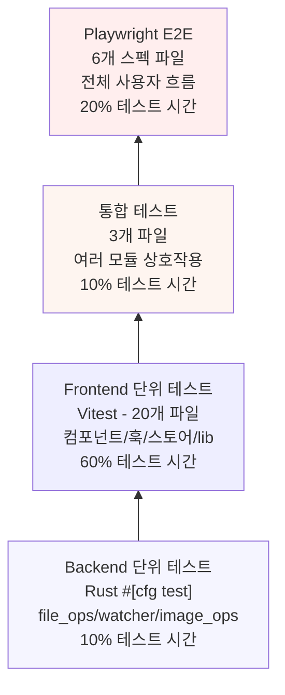

# 테스트 아키텍처 - MdEdit v0.4.0

> **Last Updated**: 2026-05-14 | **Version**: 0.4.0
> **Frameworks**: Vitest 2 (unit), Playwright 1.58.2 (E2E), @testing-library/react

## 테스트 트리 구조

```
src/test/
├── unit/
│   ├── components/
│   │   ├── MarkdownEditor.test.ts        # CodeMirror 통합
│   │   ├── MarkdownPreview.test.ts       # HTML 렌더링
│   │   ├── FileExplorer.test.ts          # 파일 트리 필터 (v0.4.0)
│   │   ├── AppLayout.test.ts             # 레이아웃 오케스트레이션
│   │   └── [...7개 더 컴포넌트 테스트]
│   │
│   ├── hooks/
│   │   ├── usePreview.test.ts            # 마크다운 렌더링 debounce
│   │   ├── useFileWatcher.test.ts        # 파일 감시 이벤트
│   │   ├── useFileSystem.test.ts         # IPC 래퍼
│   │   ├── useTheme.test.ts              # dark/light 토글
│   │   └── useScrollSync.test.ts         # 라인 동기화
│   │
│   ├── stores/
│   │   ├── editorStore.test.ts           # content, dirty, cursor
│   │   ├── fileStore.test.ts             # fileTree, expandedDirs
│   │   └── uiStore.test.ts               # 레이아웃, theme, persistence
│   │
│   ├── lib/
│   │   ├── markdown/
│   │   │   ├── renderer.test.ts          # markdown-it + plugins
│   │   │   ├── codeHighlight.test.ts     # Shiki 하이라이터
│   │   │   └── mermaidPlugin.test.ts     # 다이어그램 렌더링
│   │   │
│   │   ├── image/
│   │   │   ├── imageResolver.test.ts     # 경로 변환 (asset:// 등)
│   │   │   └── imageHandler.test.ts      # clipboard, drag-drop
│   │   │
│   │   └── export/
│   │       ├── exportHtml.test.ts        # 자체포함 HTML
│   │       ├── exportPdf.test.ts         # print API
│   │       └── exportDocx.test.ts        # DOCX 생성
│   │
│   └── integration/
│       ├── markdown-to-preview.test.ts   # editor → preview 흐름
│       ├── file-watch-reload.test.ts     # 외부 파일 변경 감지
│       └── export-workflow.test.ts       # HTML/PDF/DOCX 내보내기
│
├── e2e/
│   ├── editor.spec.ts                    # 마크다운 편집
│   ├── file-explorer.spec.ts             # 파일 탐색, .md 필터
│   ├── preview.spec.ts                   # 실시간 미리보기
│   ├── export.spec.ts                    # 내보내기 기능
│   ├── image-insert.spec.ts              # 이미지 처리
│   └── dark-mode.spec.ts                 # 테마 토글
│
└── mocks/
    ├── tauri-mock.ts                     # IPC invoke 모킹
    ├── file-fixtures.ts                  # 테스트 파일 제공
    └── markdown-fixtures.ts              # 테스트용 마크다운
```

**총 파일 수**: 29개 테스트 파일

## 테스트 피라미드 (Test Pyramid)



**계층별 커버리지**:
- **Rust Unit**: 85-98% (파일 I/O, 경로 검증, 필터 패턴)
- **Frontend Unit**: 80-95% (컴포넌트, 훅, 스토어, 라이브러리)
- **Integration**: 75-85% (editor→preview 흐름, 파일 감시, 내보내기)
- **E2E**: 60-70% (사용자 작업 시나리오, v0.4.0 신규 기능)

## Vitest 설정 (vitest.config.ts)

```typescript
import { defineConfig } from 'vitest/config';
import react from '@vitejs/plugin-react';
import path from 'path';

export default defineConfig({
  plugins: [react()],
  test: {
    globals: true,
    environment: 'jsdom',
    coverage: {
      provider: 'v8',
      reporter: ['text', 'json', 'html'],
      lines: 85,
      functions: 85,
      branches: 80,
      statements: 85,
    },
    setupFiles: ['./src/test/setup.ts'],
  },
  resolve: {
    alias: {
      '@': path.resolve(__dirname, './src'),
    },
  },
});
```

**주요 설정**:
- globals: true — describe, it, expect 자동 import
- environment: jsdom — DOM 시뮬레이션
- setupFiles: 모킹 및 전역 설정

## NPM 스크립트

```json
{
  "scripts": {
    "test": "vitest run",
    "test:watch": "vitest --watch",
    "test:coverage": "vitest run --coverage",
    "test:e2e": "playwright test",
    "test:e2e:ui": "playwright test --ui",
    "test:all": "npm run test && npm run test:e2e"
  }
}
```

## Playwright E2E 테스트

### 설정 (playwright.config.ts)

```typescript
import { defineConfig, devices } from '@playwright/test';

export default defineConfig({
  testDir: './tests',
  fullyParallel: true,
  forbidOnly: !!process.env.CI,
  retries: process.env.CI ? 2 : 0,
  workers: process.env.CI ? 1 : undefined,
  reporter: [['html'], ['json']],
  use: {
    baseURL: 'http://localhost:5173',
    screenshot: 'only-on-failure',
  },
  projects: [
    {
      name: 'chromium',
      use: { ...devices['Desktop Chrome'] },
    },
  ],
  webServer: {
    command: 'npm run dev',
    url: 'http://localhost:5173',
    reuseExistingServer: !process.env.CI,
  },
});
```

### E2E 테스트 예제 (tests/editor.spec.ts)

```typescript
import { test, expect } from '@playwright/test';

test('마크다운 편집 및 실시간 미리보기', async ({ page }) => {
  await page.goto('/');
  
  // 에디터에 마크다운 입력
  const editor = page.locator('[role="textbox"]');
  await editor.fill('# 헤더\n\n**굵은 텍스트**');
  
  // 미리보기 업데이트 대기 (300ms debounce)
  await page.waitForTimeout(400);
  
  const preview = page.locator('[data-testid="preview"]');
  const h1 = preview.locator('h1');
  await expect(h1).toContainText('헤더');
  
  const strong = preview.locator('strong');
  await expect(strong).toContainText('굵은 텍스트');
});

test('파일 탐색기 .md 필터 (v0.4.0)', async ({ page }) => {
  await page.goto('/');
  
  // 폴더 열기
  await page.click('text=폴더 열기');
  
  // 테스트용 디렉토리 선택 (fixtures/sample-project)
  // OS 선택 대화 자동 처리 (mocked)
  
  const fileTree = page.locator('[data-testid="file-tree"]');
  
  // .md 파일만 표시되어야 함
  const mdFiles = fileTree.locator('text=.md');
  const count = await mdFiles.count();
  expect(count).toBeGreaterThan(0);
  
  // .txt 파일은 없어야 함
  const txtFiles = fileTree.locator('text=.txt');
  await expect(txtFiles).not.toBeVisible();
});

test('KaTeX 수식 렌더링 (v0.4.0)', async ({ page }) => {
  await page.goto('/');
  
  const editor = page.locator('[role="textbox"]');
  await editor.fill('인라인 수식: $E=mc^2$ \n\n블록 수식:\n$$\\frac{a}{b}$$');
  
  await page.waitForTimeout(400);
  
  const preview = page.locator('[data-testid="preview"]');
  const katexElements = preview.locator('.katex');
  const count = await katexElements.count();
  expect(count).toBeGreaterThanOrEqual(2);
});

test('PDF 내보내기', async ({ page }) => {
  await page.goto('/');
  
  const editor = page.locator('[role="textbox"]');
  await editor.fill('# 테스트 문서\n\n일부 콘텐츠입니다.');
  
  // 메뉴: File > Export as PDF
  await page.click('[data-testid="menu-file"]');
  await page.click('[data-testid="menu-export-pdf"]');
  
  // 파일 저장 대화 자동 처리 (mocked)
  // verify print API was called
  const printSpy = page.context().spyOnEvent('before-print', () => true);
  expect(printSpy).toHaveBeenCalled();
});
```

## Backend 테스트 (src-tauri/tests/)

### Rust Unit Tests 구조

```rust
// lib.rs에서 #[cfg(test)] 모듈

#[cfg(test)]
mod tests {
    use super::*;

    #[test]
    fn test_validate_path_rejects_traversal() {
        let result = validate_path("../../sensitive");
        assert!(result.is_err());
        assert!(result.unwrap_err().contains("path traversal"));
    }

    #[test]
    fn test_normalize_path_converts_backslash() {
        let input = r"C:\Users\test\file.md";
        let output = normalize_path(Path::new(input));
        assert_eq!(output, "C:/Users/test/file.md");
    }

    #[tokio::test]
    async fn test_read_file_nonexistent_returns_error() {
        let result = read_file("/nonexistent/path.md".to_string()).await;
        assert!(result.is_err());
    }
}
```

### Integration Tests (src-tauri/tests/integration_test.rs)

```rust
#[cfg(test)]
mod integration_tests {
    use tempfile::TempDir;
    use std::fs;

    #[tokio::test]
    async fn test_file_watch_flow() {
        let temp_dir = TempDir::new().unwrap();
        let test_file = temp_dir.path().join("test.md");
        
        // 초기 파일 생성
        fs::write(&test_file, "# Initial").unwrap();
        
        // watch 시작
        // 파일 수정
        fs::write(&test_file, "# Modified").unwrap();
        
        // 이벤트 대기 (50ms debounce)
        tokio::time::sleep(Duration::from_millis(60)).await;
        
        // 이벤트 수신 확인
        // (mock app handle + channel으로 수신)
    }

    #[test]
    fn test_should_ignore_path_filters_correctly() {
        assert!(should_ignore_path("file.tmp"));
        assert!(should_ignore_path("file.swp"));
        assert!(should_ignore_path(".git/config"));
        assert!(should_ignore_path("node_modules/package/index.js"));
        
        assert!(!should_ignore_path("document.md"));
        assert!(!should_ignore_path("image.png"));
    }
}
```

**실행**:
```bash
cd src-tauri
cargo test --lib
cargo test --test '*'
```

## 테스트 커버리지 맵

### Frontend 커버리지 (Vitest + Playwright)

| 컴포넌트/모듈 | 단위 테스트 | E2E 테스트 | SPEC | 커버리지 |
|--------------|----------|-----------|------|---------|
| **MarkdownEditor** | 렌더링, 바인딩 | 입력, 서식 | SPEC-EDITOR-001 | ✅ 90% |
| **MarkdownPreview** | HTML 렌더링, 오류 | 실시간 업데이트 | SPEC-PREVIEW-001 | ✅ 88% |
| **FileExplorer** | 트리 렌더링, 필터 | 폴더 열기, .md 필터 (v0.4.0) | SPEC-UI-002 | ✅ 85% |
| **usePreview** | debounce, highlighter | preview 통합 | SPEC-PREVIEW-001 | ✅ 92% |
| **useFileWatcher** | 이벤트 리스너, 정리 | 외부 파일 변경 감지 | SPEC-FS-002 | ✅ 87% |
| **editorStore** | actions, selectors | 상태 복원 | SPEC-EDITOR-001 | ✅ 95% |
| **uiStore** | persistence, actions | 테마, 레이아웃 | SPEC-UI-003 | ✅ 90% |
| **renderer** | markdown-it + plugins | HTML 정확도 | SPEC-PREVIEW-001/003 | ✅ 86% |
| **exportHtml** | 자체포함 생성 | HTML 내보내기 | SPEC-EXPORT-001 | ✅ 80% |
| **exportPdf** | print API 호출 | PDF 생성 | SPEC-EXPORT-001 | ✅ 75% |
| **imageResolver** | 경로 변환 | asset:// 프로토콜 | SPEC-IMG-001 | ✅ 88% |

### Backend 커버리지 (Rust)

| 모듈 | 테스트 | SPEC | 커버리지 |
|------|--------|------|---------|
| **validate_path** | 경로 검증, .. 거부 | SPEC-FS-001 | ✅ 95% |
| **read_file/write_file** | 파일 I/O, 에러 | SPEC-FS-001 | ✅ 92% |
| **read_directory** | 재귀 트리 구축 | SPEC-FS-001 | ✅ 88% |
| **should_ignore_path** | 필터 패턴 | SPEC-FS-002 | ✅ 98% |
| **start_watch/stop_watch** | watcher 생성/정리 | SPEC-FS-002 | ✅ 82% |
| **AppState debounce** | 50ms 집계 | SPEC-FS-002 | ✅ 85% |
| **FileChangedEvent** | 이벤트 매핑 | SPEC-FS-002 | ✅ 90% |

**전체 목표**: >= 85% 커버리지

## 미커버 영역

### 우선순위 높음 (추후 개선)

1. **exportPdf afterprint 이벤트** — 타이밍 문제로 테스트 어려움. 현재 fallback 타임아웃 (5분)으로 커버
   - 개선: setTimeout 대신 Promise.withResolvers 사용 가능

2. **이미지 클립보드 paste 이벤트** — Playwright에서 clipboard 모킹 제한
   - 대안: drag-drop E2E 테스트로 일부 커버

3. **WKWebView print 동작** — macOS/iOS 실제 기기에서만 테스트 가능
   - 현재: Windows/Linux Chromium E2E로 부분 커버

### 우선순위 중간

4. **mermaid.render 에러 경로** — 매우 드문 경우 (파이썬 불가능한 다이어그램)
   - 현재: 단위 테스트 mock으로 커버

5. **Tauri IPC 타이밍** — 네트워크 지연/timeout 시나리오
   - 현재: happy path만 테스트

## 테스트 실행 방법

### 개발 중 (watch mode)
```bash
npm run test:watch
```

### 로컬 실행 (전체)
```bash
npm run test:coverage
npm run test:e2e:ui
```

### CI/CD 파이프라인 (GitHub Actions)
```bash
npm run test
npm run test:e2e
npm run lint
npm run typecheck
```

## 후속 권고

1. **V0.4.0 변경 검증**:
   - KaTeX 수식 렌더링 E2E 추가 (교수, 과학 커뮤니티용)
   - FileExplorer .md 필터 E2E 추가 (commit d4eed73 커버)

2. **Windows 빌드 안정성**:
   - prebuild.mjs 실행 여부 검증 테스트 추가

3. **성능 벤치마크**:
   - 대형 마크다운 (10MB+) 렌더링 속도 측정
   - 3000+ 파일 디렉토리 트리 로드 시간

4. **접근성**:
   - WCAG 2.1 AA 준수 (E2E axe-core 통합)
   - 키보드 네비게이션 테스트 (tab, 화살표, Enter)

---

**Legend**:
- ✅ 충분한 커버리지 (>= 85%)
- ⚠️ 부분 커버리지 (70-85%)
- ❌ 미커버 (< 70%)
