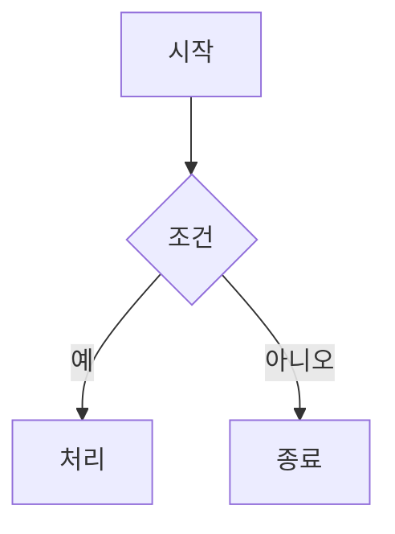

## HISTORY

| Version | Date | Author | Changes |
|---------|------|--------|---------|
| 0.0.1 | 2026-07-22 | jw | 최초 acceptance 작성 — Given-When-Then 시나리오 13건(AC-UI-008-001~013) + 품질 게이트. plan-audit 리뷰(SPEC-UI-008-review-1) D3 반영: spec.md의 dangling `acceptance.md` 참조 해소. spec.md의 재번호(REQ-001~022) 및 AC 재구성(D1/D2/D6)과 1:1 정합. 확정 결정 반영: 7종 프리셋 + 사용자 정의 빈 펜스, 즉시 렌더, 빈-펜스 플레이스홀더, AI 흐름 무변경·AI 토글 무관, 신규 런타임 의존성/단축키 없음. |

# Acceptance Criteria — SPEC-UI-008 (다이어그램 삽입 서브메뉴)

검증 방식: **컴포넌트/단위 테스트 중심** — vitest + @testing-library/react(툴바/드롭다운) + jsdom `EditorView` 직접 구성(`insertDiagram` 단위 테스트, `src/test/insertDiagram.test.ts`; `image-widget.test.ts`/`insertTable.test.ts` 선례) + `PreviewRenderer.test.tsx`(빈-펜스 플레이스홀더). 프리셋 스니펫의 mermaid 파싱 성공은 mermaid 11.12.3 `mermaid.parse`로 검증한다. 기존 Playwright E2E 스위트는 무변경 통과해야 하며, 본 SPEC은 신규 E2E를 요구하지 않는다(관련 시 선택적).

## Given-When-Then Scenarios

### AC-UI-008-001: 드롭다운 열림 (REQ-UI-008-004, 007)

- **Given** 에디터 툴바가 렌더되어 있고 드롭다운이 닫힌 상태(`aria-expanded="false"`)일 때
- **When** 사용자가 "다이어그램" 트리거 버튼을 클릭하면
- **Then** 드롭다운이 열리고 트리거의 `aria-expanded="true"`가 되며, 8개 항목(7종 프리셋 + 사용자 정의)이 세로 목록으로 표시된다.

### AC-UI-008-002: 항목 접근성 + 아이콘 렌더/구별 (REQ-UI-008-001, 002, 003)

- **Given** 다이어그램 드롭다운이 열려 있을 때
- **When** 8개 항목을 검사하면
- **Then** 각 항목이 비어 있지 않은 `aria-label`과 한글 라벨 텍스트를 갖는다.
- **And** 7종 프리셋 항목의 아이콘이 `<svg>` 요소로 렌더되고 `stroke="currentColor"`를 상속한다(별도 색상 하드코딩 없음).
- **And** 7종 프리셋 아이콘의 SVG path 마크업이 서로 달라 두 프리셋이 동일 아이콘을 공유하지 않는다(중복 0).

### AC-UI-008-003: 프리셋 삽입 + 커서 배치 + 닫힘 (REQ-UI-008-008, 009)

- **Given** 커서가 빈 줄에 위치한 EditorView가 있고 드롭다운이 열린 상태일 때
- **When** 프리셋 항목(예: 순서도)을 선택하면
- **Then** 커서 위치에 해당 프리셋의 정확한 스니펫이 ```mermaid 펜스로 삽입된다. 예(순서도):

````

````

- **And** 에디터 selection(커서)이 해당 프리셋의 첫 편집 토큰(순서도의 경우 `시작`) 위치에 놓이고 `view.focus()`로 에디터가 포커스를 가지며, 드롭다운은 닫힌다.
- **And** 나머지 6종(시퀀스 다이어그램→`사용자`, 간트 차트→`프로젝트 일정`, 클래스 다이어그램→`동물`, 상태 다이어그램→`대기`, 파이 차트→`분포 현황`, 마인드맵→`중심 주제`)도 spec.md "Preset Snippet Definitions"의 스니펫·첫 편집 토큰과 정확히 일치한다.

### AC-UI-008-004: 프리셋 스니펫 mermaid 파싱 성공 (REQ-UI-008-008, 020)

- **Given** spec.md에 정의된 7종 프리셋 스니펫(펜스 내부 본문)이 있을 때
- **When** mermaid 11.12.3 `mermaid.parse(snippet)`를 각 스니펫에 대해 호출하면
- **Then** flowchart / sequenceDiagram / gantt / classDiagram / stateDiagram-v2 / pie / mindmap 7종 전부가 예외/오류 없이 파싱에 성공한다(삽입 즉시 렌더 가능).
- **And** mermaid 버전 핀(11.12.3, SPEC-PREVIEW-006)은 변경되지 않는다.

### AC-UI-008-005: 사용자 정의 빈 펜스 삽입 (REQ-UI-008-010)

- **Given** 커서가 빈 줄에 위치한 EditorView가 있고 드롭다운이 열린 상태일 때
- **When** "사용자 정의" 항목을 선택하면
- **Then** 커서 위치에 본문이 빈 ```mermaid 펜스가 삽입된다:

````
```mermaid

```
````

- **And** 커서가 펜스 본문(빈 줄)에 놓이고 `view.focus()`로 에디터가 포커스를 가지며, 드롭다운은 닫힌다.

### AC-UI-008-006: 빈 펜스 플레이스홀더 (REQ-UI-008-013)

- **Given** 프리뷰에 본문이 비어 있거나 공백만 있는 `.mermaid-container`(빈 `data-diagram`)가 있을 때
- **When** `PreviewRenderer`가 해당 컨테이너를 처리하면
- **Then** `mermaid.parse`를 호출하지 않고 안내 플레이스홀더("다이어그램 문법을 입력하세요" 스타일)를 컨테이너에 표시한다.
- **And** `⚠ Diagram syntax error` 폴백 문구는 표시되지 않는다.

### AC-UI-008-007: 빈 펜스에 내용 입력 시 전환 (REQ-UI-008-014) [edge]

- **Given** 앞서 빈 상태였던 ```mermaid 펜스가 있을 때
- **When** 펜스 본문에 비어 있지 않은 내용이 입력되어 `data-diagram`이 비어 있지 않게 되면
- **Then** 플레이스홀더가 제거되고 통상적인 mermaid 파싱/렌더 경로로 전환된다 — 유효한 다이어그램이면 렌더되고, 문법 오류이면 기존 `⚠ Diagram syntax error` 폴백이 표시된다.

### AC-UI-008-008: 줄 중간 삽입 — 블록 패딩 (REQ-UI-008-015) [edge]

- **Given** 커서가 텍스트가 있는 줄의 중간(커서 앞뒤 모두 텍스트 존재)에 위치할 때
- **When** 프리셋 또는 사용자 정의 항목을 선택해 펜스를 삽입하면
- **Then** 펜스 앞뒤에 빈 줄이 삽입되어 다이어그램이 독립된 markdown 블록이 된다.
- **And** 커서가 줄 시작(앞 텍스트 없음) 또는 줄 끝(뒤 텍스트 없음)에 있으면 필요한 쪽에만 패딩된다.

### AC-UI-008-009: view-only 모드 no-op (REQ-UI-008-016) [edge]

- **Given** view-only 모드로 EditorView가 null(`viewRef.current === null`)이고 툴바는 렌더된 상태일 때
- **When** 드롭다운을 열고 항목을 선택하면
- **Then** 문서 변경이 발생하지 않고, 예외/에러가 발생하지 않으며, 드롭다운은 닫힌다(기존 `handleFormat`/`handleInsertTable` null 가드 패턴과 동일한 no-op).

### AC-UI-008-010: 외부 클릭 / Escape / 키보드 조작 (REQ-UI-008-011, 012) [edge]

- **Given** 다이어그램 드롭다운이 열려 있을 때
- **When** 드롭다운·트리거 외부 요소에 mousedown이 발생하면
- **Then** 드롭다운이 닫히고 `aria-expanded="false"`가 된다.
- **When** (다시 연 상태에서) Escape 키가 눌리면
- **Then** 드롭다운이 닫힌다.
- **When** 방향키 또는 Tab을 누르면
- **Then** 항목 간 포커스가 순회 이동하고, Enter 또는 Space로 포커스된 항목을 선택할 수 있다.

### AC-UI-008-011: 다크모드 토큰 (REQ-UI-008-005)

- **Given** 드롭다운/플레이스홀더 관련 신규 CSS와 프리셋 아이콘이 적용된 상태에서
- **When** 신규 CSS/아이콘 마크업을 검사하면
- **Then** 모든 신규 클래스가 `--md-*` 토큰 및 `currentColor`만 참조하고 raw hex 색상 리터럴이 없다(다크모드는 `[data-theme="dark"]` 토큰 전환으로 자동).

### AC-UI-008-012: AI 경계 + 기존 계약 회귀 방어 (REQ-UI-008-006, 017, 018)

- **Given** AI 토글(SPEC-AI-005)이 비활성(OFF)인 상태에서
- **When** 다이어그램 삽입 메뉴를 열고 항목을 선택하면
- **Then** 메뉴가 정상 노출되고 삽입 동작이 AI 토글 활성 상태와 동일하게 수행된다(삽입 경로가 AI 토글 상태를 참조하지 않음).
- **And** 기존 AI 다이어그램 생성 흐름(ai-suggestion-card, `src/lib/ai/mermaidValidate.ts`)의 코드·테스트가 무변경이고, 수동 삽입 경로는 이를 호출하지 않는다.
- **And** 기존 `onFormat` 콜백 테스트가 무변경 통과하고, `FormatAction` 유니언·`onInsertTable`·`handleFormat` switch(@MX:ANCHOR)가 변경되지 않는다.

### AC-UI-008-013: 회귀 가드 — 의존성/프리셋 개수/키맵 (REQ-UI-008-019, 021, 022)

- **Given** 본 SPEC의 전체 변경이 적용된 상태에서
- **When** `package.json`과 프리셋 목록, 키 바인딩을 검사하면
- **Then** `package.json` dependencies/devDependencies에 신규 런타임 의존성이 0건이다(`lucide-react`/floating-ui 등 미추가).
- **And** 프리셋 목록이 정확히 8항목(7종 프리셋 + 사용자 정의)이며 나머지 17종 mermaid 유형이 프리셋으로 추가되지 않았다.
- **And** `markdownKeyBindings`에 신규 바인딩이 없다(전역 단축키 미등록).

## Quality Gate Criteria

| 게이트 | 기준 |
|--------|------|
| 타입 체크 | `npm run typecheck`(`tsc --noEmit`) 클린 (에러 0) |
| 단위/컴포넌트 테스트 | `npm test`(vitest) 전체 통과 — 신규(`insertDiagram.test.ts`, `DiagramInsertMenu.test.tsx`) + 확장(`EditorToolbar.test.tsx` 접근성 스위트, `PreviewRenderer.test.tsx` 플레이스홀더) + 기존 전체 무변경 통과 |
| E2E | 기존 Playwright(`npm run test:e2e`) 스위트 무변경 통과. 신규 E2E는 필수 아님(관련 시 선택적) |
| Lint | `npm run lint` 통과 — PR #37(2026-07-20)에서 eslint 설정이 추가되어 정상 게이트로 복귀했으므로, lint 실패는 본 SPEC 구현의 실제 결함으로 취급한다 |
| 커버리지 | 신규 코드 커밋당 80% 이상, 전체 목표 85% |
| 의존성 | `package.json` dependencies/devDependencies 무변경 |
| 보안 불변식 | mermaid `securityLevel: 'strict'`, `startOnLoad: false` 유지(SPEC-PREVIEW-010), mermaid 버전 핀 11.12.3 유지(SPEC-PREVIEW-006) |

## Definition of Done

- [ ] AC-UI-008-001 ~ 013 전 시나리오에 대응하는 테스트가 존재하고 통과
- [ ] REQ-UI-008-001 ~ 022 전 요구사항이 테스트 또는 diff 리뷰로 검증됨(spec.md AC 표 하단 REQ→AC 대조 참조)
- [ ] 프리셋 7종 스니펫이 mermaid 11.12.3 `parse`를 오류 없이 통과
- [ ] 빈/공백 펜스가 플레이스홀더를 표시하고 `⚠ Diagram syntax error`를 표시하지 않음
- [ ] `npm run typecheck` 클린, `npm test` 전체 통과, 기존 Playwright 무변경 통과, `npm run lint` 통과
- [ ] 기존 AI 흐름(ai-suggestion-card, `mermaidValidate.ts`) 무변경 확인, AI 토글 OFF에서 삽입 동작 확인
- [ ] 신규 런타임 의존성 0 확인, 프리셋 목록 8항목 고정 확인, `markdownKeyBindings` 무변경 확인
- [ ] @MX 태그 적용(`insertDiagram` @MX:NOTE, `handleFormat` @MX:ANCHOR 유지, `PreviewRenderer` 플레이스홀더 분기 @MX:NOTE)
