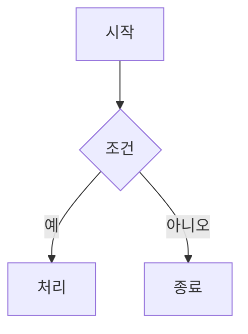
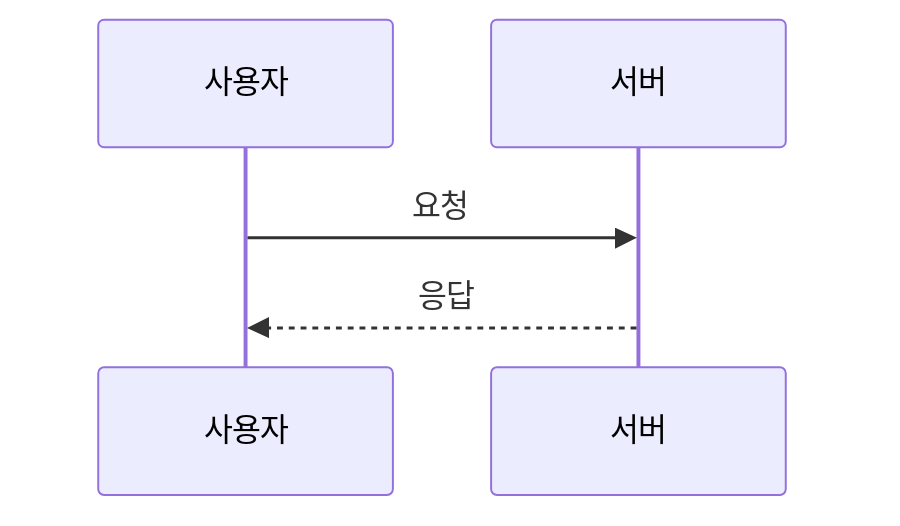
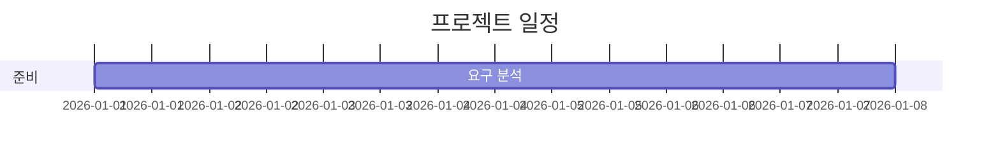
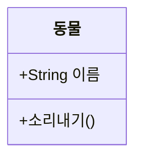
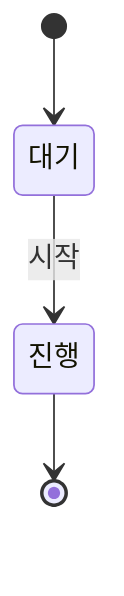
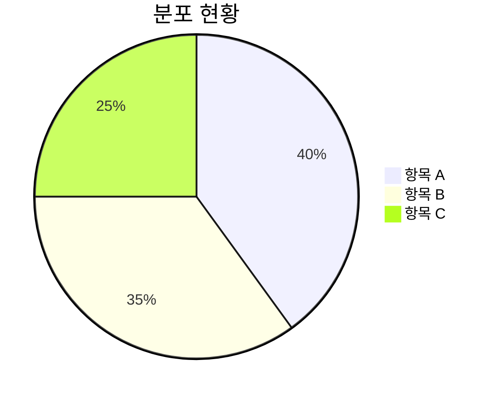
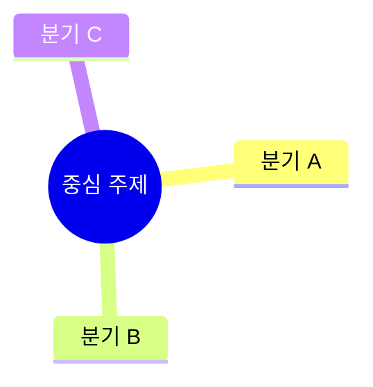

## HISTORY

| Version | Date | Author | Changes |
|---------|------|--------|---------|
| 0.0.1 | 2026-07-22 | jw | 최초 SPEC 작성 — 에디터 툴바 "다이어그램" 버튼 + 드롭다운 서브메뉴(7종 프리셋 + 사용자 정의 빈 펜스). 사용자 확정 결정 반영: (1) 진입점 = EditorToolbar.tsx 신규 "다이어그램" 버튼(SPEC-UI-007 Insert Table 팝오버 선례 재사용), (2) 프리셋 7종 = flowchart/sequenceDiagram/gantt/classDiagram/stateDiagram-v2/pie/mindmap, 각 항목 = 흑백 스켈레톤 아이콘(16–24px 가독) + 한글 라벨, (3) 프리셋 선택 = 즉시 오류 없이 렌더되는 3–5줄 한글 예제 ```mermaid 펜스 삽입 + 첫 편집 토큰에 커서, (4) 사용자 정의(8번째) = 빈 ```mermaid 펜스 삽입 + 프리뷰 플레이스홀더("다이어그램 문법을 입력하세요"), (5) AI 경계 = 수동 삽입 전용, 기존 AI 생성 흐름(ai-suggestion-card + mermaidValidate, SPEC-AI-003/004) 무변경·AI 토글(SPEC-AI-005) 상태 무관. |
| 0.0.2 | 2026-07-22 | jw | plan-audit 리뷰(SPEC-UI-008-review-1, FAIL 0.71) 반영 — 결함 6건 수정: **D1** REQ-016(AI 토글 무관, 긍정형)을 Unwanted→Ubiquitous로 이동하고 "정상 동작" weasel을 이진 술어("AI 토글 상태를 참조하지 않고 노출·삽입 동작 수행")로 치환(신 REQ-006). **D6** REQ-002(아이콘 렌더+판독성+테마+raw hex 4관심사)를 002(SVG+currentColor)/003(종류별 형상 구별)/005(토큰·raw hex)로 분해, REQ-020(17종+단축키)을 021(프리셋 8항목 고정)/022(markdownKeyBindings 무변경)로 분해. **D4** REQ-002 "16–24px 판독 가능" 비이진 문구를 정규 요구에서 제거하고 Design Notes로 완전 이관. **분해에 따른 클린 재번호(001–022, 순차·결번 0)** 및 전 cross-reference 갱신. **D2** AC 표를 재구성하여 REQ-001~022 전수 커버(신 AC-013 = REQ-019/021/022 회귀 가드: package.json 의존성 0·프리셋 8항목·keymap 무변경), 표 하단에 REQ→AC 전수 대조 추가. **D3** acceptance.md 신규 작성(dangling 참조 해소, Given-When-Then 13건 + Quality Gate Criteria). **D5** Delta에 `PreviewRenderer.test.tsx`(빈-펜스 플레이스홀더 검증) 추가. 스니펫 코드·lint 게이트 노트(PR #37 반영)는 무변경. |

## Summary

`mdedit` (Tauri v2 + React 18 + TypeScript + CodeMirror 6) 에디터 툴바에 **다이어그램** 버튼을 추가한다. 버튼은 Insert Table 그리드 피커와 동일한 팝오버/드롭다운 셸(SPEC-UI-007 선례)을 재사용하며, 클릭 시 8개 항목의 드롭다운 서브메뉴가 열린다. 상위 7개 항목은 프리셋 다이어그램(flowchart, sequenceDiagram, gantt, classDiagram, stateDiagram-v2, pie, mindmap)으로 각각 **흑백 스켈레톤 아이콘**(다이어그램 형태를 추상화, 16–24px에서 판독 가능한 골격형) + **한글 라벨**을 표시한다. 8번째 항목은 **사용자 정의**로 빈 ```mermaid 펜스를 삽입한다.

프리셋 항목을 선택하면 커서 위치에 해당 프리셋의 **3–5줄 한글 최소 예제**를 담은 ```mermaid 펜스 블록이 독립 블록으로 삽입되고, 삽입 즉시 오류 없이 렌더되며(mermaid 11.12.3 → `mermaidPlugin.ts` → `PreviewRenderer`), 커서는 첫 사용자 편집 토큰에 놓인다. 사용자 정의 항목을 선택하면 빈 ```mermaid 펜스가 삽입되고, 펜스 본문이 비어 있는 동안 프리뷰는 mermaid 파싱 오류 대신 **플레이스홀더 안내**("다이어그램 문법을 입력하세요" 스타일)를 표시한다. 본문에 내용이 입력되면 플레이스홀더는 사라진다.

핵심 설계 결정(사용자 승인, 재검토 금지):

- **진입점**: `src/components/editor/EditorToolbar.tsx`에 "다이어그램" 트리거 버튼 신설. SPEC-UI-007 `TableGridPicker`가 검증한 팝오버 셸(relative 래퍼 + `absolute top-full z-50`, 외부 mousedown + Escape 닫힘, 포털 없음)을 드롭다운 메뉴 형태로 재사용한다.
- **아이콘**: 7종 프리셋 아이콘을 SPEC-UI-006 아이콘 규약(`svgProps` 헬퍼 인라인, `stroke="currentColor"`, 런타임 의존성 미도입)에 따라 `src/components/icons/icons.tsx`에 인라인한다. 형태는 상세 일러스트가 아닌 **흑백 골격**(예: flowchart = 상자+화살표, pie = 원+파이 슬라이스)으로 16–24px에서 판독 가능해야 한다. 다크/라이트는 `currentColor` 상속으로 자동.
- **삽입 계약**: 기존 `FormatAction`/`onFormat`/`onInsertTable` 계약을 변경하지 않고 별도 `onInsertDiagram(preset)` prop을 신설한다.
- **삽입 헬퍼**: SPEC-UI-007 `insertTable`과 동일한 CodeMirror dispatch 패턴으로 `keyboard-shortcuts.ts`에 `insertDiagram(view, preset)`를 배치한다.
- **AI 경계**: 본 SPEC은 **수동 삽입 전용**이다. 기존 AI 다이어그램 생성 흐름(ai-suggestion-card, `mermaidValidate.ts`; SPEC-AI-003/004 계보)은 범위 밖이며 무변경이다. 수동 삽입은 AI 토글(SPEC-AI-005) 상태와 무관하게 동작한다.

## Background & Rationale

현재 mermaid 다이어그램은 프리뷰에서 렌더되지만(SPEC-PREVIEW-001), 사용자가 다이어그램을 넣으려면 ```mermaid 펜스와 다이어그램 문법을 처음부터 직접 타이핑해야 한다. mermaid는 다이어그램 종류별로 헤더 키워드(`flowchart TD`, `sequenceDiagram`, `gantt` 등)와 문법이 상이해 진입 장벽이 높고, 빈 펜스는 즉시 파싱 오류(`⚠ Diagram syntax error`)를 유발해 "작성 중" 상태가 오류처럼 보인다.

본 SPEC은 시각적 드롭다운 메뉴에서 프리셋을 골라 **즉시 렌더되는 최소 예제**를 삽입하게 하여 진입 장벽을 낮추고, 사용자 정의 항목의 빈 펜스에 대해서는 파싱 오류 대신 안내 플레이스홀더를 보여 작성 흐름을 개선한다.

기술 컨텍스트(소스 근거):

- 툴바 삽입 확장 선례: SPEC-UI-007이 `onInsertTable(rows, cols)` prop과 `insertTable` 헬퍼, 팝오버 셸을 이미 도입했다(EditorToolbar.tsx:88–178, keyboard-shortcuts.ts:119–145, AppLayout.tsx:300–305). 동일 패턴을 `onInsertDiagram`/`insertDiagram`으로 확장하는 것이 최소 침습이다.
- mermaid 렌더 경로: `mermaidPlugin.ts:13–24`가 ```mermaid 펜스를 `.mermaid-container[data-diagram]` div로 치환하고, `PreviewRenderer.tsx:113–124`가 컨테이너마다 `mermaid.parse` → `mermaid.render`를 수행한다. **빈/공백 본문은 `mermaid.parse('')`가 throw → catch에서 `⚠ Diagram syntax error`로 폴백**된다(PreviewRenderer.tsx:121–123). 사용자 정의 빈 펜스의 플레이스홀더 요구는 이 경로에 "본문이 비어 있으면 parse를 건너뛰고 플레이스홀더를 표시" 분기를 추가해야 한다.
- 다크 테마: SPEC-PREVIEW-010이 앱 테마↔mermaid 테마 연동(`isDark` 파생 + 재초기화·재렌더, `securityLevel: 'strict'` 유지)을 이미 구현했다. 프리셋 삽입 결과는 이 테마 연동을 그대로 상속하며 본 SPEC은 그 경로를 변경하지 않는다.
- AI 경계: `src/lib/ai/mermaidValidate.ts`와 ai-suggestion-card(SPEC-AI-003/004)는 AI가 생성한 mermaid를 검증·삽입하는 별도 흐름이다. 본 SPEC의 수동 삽입은 이들을 호출하지 않으며 AI 토글 상태(SPEC-AI-005)를 참조하지 않는다.

## Environment & Assumptions

- 프론트엔드: React 18, TypeScript strict, CodeMirror 6, Tailwind CSS 3 + SPEC-UI-006 `.md-*` 토큰/컴포넌트 CSS.
- EditorView 접근: `AppLayout.tsx`의 `viewRef.current`(`handleViewReady`, AppLayout.tsx:228). view-only 판정은 `isViewOnly`(AppLayout.tsx:314).
- 프리뷰 렌더러: mermaid 11.12.3(SPEC-PREVIEW-006 핀), `mermaidPlugin.ts` + `PreviewRenderer.tsx`. 테마 연동은 SPEC-PREVIEW-010.
- 프리셋 스니펫은 mermaid 11 문법으로 검증되며, 삽입 즉시 파싱/렌더 오류 없이 표시되어야 한다.
- 테스트 환경: vitest + @testing-library/react + jsdom(EditorView 직접 구성 선례: `insertTable.test.ts`, `image-widget.test.ts`), Playwright(기존 E2E).

## Requirements (EARS)

> 요구사항 원자성(defect D6/plan-audit review-1 반영): 아이콘 관련 요구는 렌더(002)·구별성(003)으로, 회귀 가드는 프리셋 목록(021)·단축키(022)로 분리했다. AI 토글 무관 요구(006)는 긍정형이므로 Unwanted가 아닌 Ubiquitous에 배치했다(D1 반영).

### Ubiquitous Requirements

- **REQ-UI-008-001**: The system **shall** 항상 드롭다운의 8개 항목(7종 프리셋 + 사용자 정의) 각각에 비어 있지 않은 `aria-label`과 한글 라벨 텍스트를 제공한다. 프리셋 항목은 다이어그램 종류를 식별하는 라벨(예: "순서도", "시퀀스 다이어그램")을 표시한다.
- **REQ-UI-008-002**: The system **shall** 항상 각 프리셋 항목의 아이콘을 SPEC-UI-006 아이콘 규약(`svgProps` 인라인)에 따라 `<svg>` 요소로 렌더하고, `stroke="currentColor"`를 상속하여 텍스트 색 변경 시 아이콘 색이 함께 반전되게 한다(별도 색상 하드코딩 없음).
- **REQ-UI-008-003**: The system **shall** 항상 7종 프리셋 아이콘이 서로 다른 SVG path 형상을 갖게 하여(종류별 구별 가능), 두 프리셋이 동일한 아이콘 마크업을 공유하지 않게 한다.
- **REQ-UI-008-004**: The system **shall** 항상 다이어그램 트리거 버튼에 `aria-label`, `title`, `aria-haspopup="true"`, `aria-expanded`(열림 상태 반영)를 유지한다.
- **REQ-UI-008-005**: The system **shall** 항상 팝오버·드롭다운·아이콘·라벨 스타일을 `--md-*` 시맨틱 토큰 및 `currentColor`만으로 렌더한다(raw hex 색상 리터럴 금지). 다크모드는 토큰 전환으로 자동 적용된다.
- **REQ-UI-008-006**: The system **shall** 항상 AI 토글(SPEC-AI-005)의 활성/비활성 상태를 참조하지 않고 다이어그램 삽입 메뉴를 노출하며, AI 토글이 비활성인 상태에서도 프리셋/사용자 정의 삽입 동작을 동일하게 수행한다.

### Event-Driven Requirements

- **REQ-UI-008-007**: **WHEN** 사용자가 다이어그램 버튼을 클릭하면, **the system shall** 버튼 아래(`top-full`, `z-50`)에 8개 항목(7종 프리셋 + 사용자 정의)을 세로로 나열한 드롭다운 서브메뉴를 연다.
- **REQ-UI-008-008**: **WHEN** 사용자가 프리셋 항목(flowchart / sequenceDiagram / gantt / classDiagram / stateDiagram-v2 / pie / mindmap 중 하나)을 선택하면, **the system shall** 커서 위치에 해당 프리셋의 3–5줄 한글 최소 예제를 담은 ```mermaid 펜스 블록(아래 "Preset Snippet Definitions" 참조)을 삽입하고 드롭다운을 닫는다. 삽입된 펜스는 mermaid 11.12.3에서 파싱/렌더 오류 없이 즉시 렌더된다.
- **REQ-UI-008-009**: **WHEN** 프리셋 삽입이 완료되면, **the system shall** 커서를 해당 프리셋의 첫 사용자 편집 토큰(아래 스니펫 표의 "첫 편집 토큰")에 놓고 에디터에 포커스를 복귀시켜, 즉시 타이핑하면 그 토큰이 편집되게 한다.
- **REQ-UI-008-010**: **WHEN** 사용자가 사용자 정의 항목을 선택하면, **the system shall** 커서 위치에 본문이 빈 ```mermaid 펜스를 삽입하고, 커서를 펜스 본문(빈 줄)에 놓은 뒤 에디터 포커스를 복귀시키고 드롭다운을 닫는다.
- **REQ-UI-008-011**: **WHEN** 드롭다운이 열린 상태에서 팝오버·트리거 외부에 mousedown이 발생하거나 Escape 키가 눌리면, **the system shall** 드롭다운을 닫는다.
- **REQ-UI-008-012**: **WHEN** 드롭다운이 열려 있고 사용자가 키보드(방향키 또는 Tab)로 이동하면, **the system shall** 항목 간 포커스를 순회 이동시키고, Enter 또는 Space로 포커스된 항목을 선택 가능하게 한다.

### State-Driven Requirements

- **REQ-UI-008-013**: **WHILE** ```mermaid 펜스의 본문이 비어 있거나 공백 문자만 있는 동안, **the system shall** 프리뷰에서 mermaid 파싱을 시도하지 않고 안내 플레이스홀더("다이어그램 문법을 입력하세요" 스타일)를 표시한다(파싱 오류 폴백 `⚠ Diagram syntax error`를 표시하지 않는다).
- **REQ-UI-008-014**: **WHILE** 앞서 빈 상태였던 ```mermaid 펜스에 본문 내용이 입력되어 비어 있지 않게 된 동안, **the system shall** 플레이스홀더를 제거하고 통상적인 mermaid 파싱/렌더 경로(성공 시 다이어그램, 실패 시 기존 `⚠ Diagram syntax error` 폴백)로 전환한다.
- **REQ-UI-008-015**: **WHILE** 커서가 비어 있지 않은 줄의 중간(커서 앞 또는 뒤에 텍스트 존재)에 있는 동안 삽입이 발생하면, **the system shall** 필요한 쪽에 빈 줄을 삽입하여 다이어그램 펜스가 독립된 markdown 블록이 되게 한다.
- **REQ-UI-008-016**: **WHILE** view-only 모드(EditorView가 null) 동안, **the system shall** 항목 선택 시 문서 변경 없이 no-op 처리하고 드롭다운을 닫는다(기존 `handleFormat`/`handleInsertTable`의 null 가드 패턴과 동일).

### Unwanted Behavior Requirements

- **REQ-UI-008-017**: The system **shall not** 기존 AI 다이어그램 생성 흐름(ai-suggestion-card, `src/lib/ai/mermaidValidate.ts`; SPEC-AI-003/004 계보)의 동작·계약을 변경하거나 호출한다. 수동 삽입(본 SPEC)과 AI 생성(기존 흐름)은 역할이 분리되며, 수동 삽입 경로는 AI 검증/제안 로직을 거치지 않는다.
- **REQ-UI-008-018**: The system **shall not** 기존 `FormatAction` 유니언 타입, `onFormat` 콜백, `onInsertTable` 콜백, `handleFormat` switch(@MX:ANCHOR)를 변경한다. 다이어그램 삽입은 별도 `onInsertDiagram(preset)` prop으로 전달된다.
- **REQ-UI-008-019**: The system **shall not** 신규 런타임 의존성(`lucide-react`, floating-ui, 팝오버/드롭다운 라이브러리 등)을 추가한다(`package.json` dependencies/devDependencies 무변경).
- **REQ-UI-008-020**: The system **shall not** mermaid 버전 핀(SPEC-PREVIEW-006, 11.12.3), `securityLevel: 'strict'` 불변식, 또는 비어 있지 않은 잘못된 다이어그램에 대한 기존 `⚠ Diagram syntax error` 폴백을 변경한다.
- **REQ-UI-008-021**: The system **shall not** 나머지 17종 mermaid 다이어그램 유형을 프리셋 목록에 추가한다(프리셋은 정확히 7종 + 사용자 정의 = 8항목으로 고정, v1).
- **REQ-UI-008-022**: The system **shall not** 신규 키보드 단축키 바인딩을 등록한다(`markdownKeyBindings` 무변경). 드롭다운 내 키보드 조작(REQ-UI-008-012)은 전역 단축키 등록이 아니므로 이에 해당하지 않는다.

## Preset Snippet Definitions

아래 7개 스니펫은 각각 ```mermaid 펜스로 감싸 삽입되며, mermaid 11.12.3 문법으로 검증되었다(즉시 파싱/렌더 성공). "첫 편집 토큰"은 REQ-UI-008-009의 커서 배치 대상이다. 한글 라벨을 사용하되 구조 키워드(`flowchart TD`, `participant`, `class` 등)는 영어를 유지한다.

### 1. flowchart — 라벨 "순서도"

````

````

첫 편집 토큰: `시작`(노드 A 라벨).

### 2. sequenceDiagram — 라벨 "시퀀스 다이어그램"

````

````

첫 편집 토큰: 첫 `사용자`(participant 이름).

### 3. gantt — 라벨 "간트 차트"

````

````

첫 편집 토큰: `프로젝트 일정`(title).

### 4. classDiagram — 라벨 "클래스 다이어그램"

````

````

첫 편집 토큰: `동물`(class 이름).

### 5. stateDiagram-v2 — 라벨 "상태 다이어그램"

````

````

첫 편집 토큰: 첫 `대기`(상태 이름).

### 6. pie — 라벨 "파이 차트"

````

````

첫 편집 토큰: `분포 현황`(title).

### 7. mindmap — 라벨 "마인드맵"

````

````

첫 편집 토큰: `중심 주제`(root 노드 라벨).

### 8. 사용자 정의 — 라벨 "사용자 정의(빈 다이어그램)"

빈 ```mermaid 펜스만 삽입하며, 커서는 본문 빈 줄에 놓인다(REQ-UI-008-010):

````
```mermaid

```
````

## Design Notes / Future Considerations

> 아래 항목은 요구사항이 아니며(AC 없음), Run phase의 설계 참고 사항이다.

- **아이콘 형태/판독성 힌트(비이진, Run phase 재량)**: 프리셋 아이콘은 골격형 추상 — flowchart(상자→화살표), sequenceDiagram(2 라이프라인+화살표), gantt(수평 막대), classDiagram(제목 칸+속성 칸 상자), stateDiagram(원+전이 화살표), pie(원+파이 슬라이스), mindmap(중심 원+방사 가지). 정확한 SVG path는 Run phase 재량이며, "16–24px 크기에서 종류 판독 가능"은 디자인 목표(수용 기준이 아닌 참고 지표)다. 이진 검증 대상은 REQ-UI-008-002(SVG+currentColor)·003(종류별 형상 구별)에 한한다.
- **커서/포커스 구현 힌트**: REQ-UI-008-009/010은 CodeMirror `EditorSelection.range`(또는 `cursor`)로 삽입 텍스트 내 대상 토큰 오프셋을 선택하고 `view.focus()`를 호출하는 방식을 상정한다(`insertTable` 선례). 구현 세부는 Run phase 재량.
- **빈 펜스 플레이스홀더 판정 힌트**: REQ-UI-008-013의 "빈 본문" 판정은 `data-diagram` 문자열을 `trim()`했을 때 빈 문자열인지로 결정하고, 이 경우 `mermaid.parse`를 호출하지 않고 플레이스홀더 마크업을 컨테이너에 주입하는 방식을 상정한다(`PreviewRenderer.tsx:113–124` 분기 추가). 플레이스홀더 문구/스타일은 `--md-text-muted` 등 토큰 사용을 권장한다.
- **드롭다운 vs 그리드 셸 차이**: SPEC-UI-007은 8×8 그리드였고 본 SPEC은 세로 리스트 메뉴다. 팝오버 컨테이너(relative 래퍼 + `absolute top-full z-50`, 외부 mousedown + Esc 닫힘)는 재사용하되 내부 레이아웃은 리스트로 구성한다.

## Delta (Brownfield Changes)

| Delta | 파일 | 변경 내용 |
|-------|------|-----------|
| [MODIFY] | `src/components/icons/icons.tsx` | 프리셋 7종 흑백 골격 아이콘 인라인 추가(`svgProps` 헬퍼, 알파벳/그룹 순서 유지) |
| [MODIFY] | `src/components/icons/index.ts` | 신규 아이콘 배럴 export |
| [MODIFY] | `src/components/editor/extensions/keyboard-shortcuts.ts` | `insertDiagram(view, preset): boolean` 헬퍼 + 프리셋 스니펫 상수 테이블 추가 |
| [MODIFY] | `src/components/editor/EditorToolbar.tsx` | `onInsertDiagram` prop + "다이어그램" 트리거 버튼/드롭다운 서브메뉴 컴포넌트 추가 |
| [MODIFY] | `src/components/layout/AppLayout.tsx` | `handleInsertDiagram` 핸들러 신설(null 가드 + `insertDiagram` + `view.focus()`) + `EditorToolbar` 배선 |
| [MODIFY] | `src/components/preview/PreviewRenderer.tsx` | 빈/공백 `data-diagram` 감지 시 `mermaid.parse` 생략하고 플레이스홀더 표시 분기 추가(REQ-013/014) |
| [MODIFY] | `src/styles/mdedit-components.css` | 드롭다운 메뉴 클래스(`.md-diagram-menu*`) + 프리뷰 빈-펜스 플레이스홀더 클래스 추가(토큰만 사용) |
| [MODIFY] | `src/test/EditorToolbar.test.tsx` | 다이어그램 버튼/드롭다운 렌더·접근성 어서션 확장 |
| [MODIFY] | `src/test/PreviewRenderer.test.tsx` | 빈/공백 `data-diagram` → 플레이스홀더 표시·`⚠ Diagram syntax error` 미표시 검증(REQ-013/014, AC-006/007); 기존 non-empty invalid diagram 폴백 테스트 회귀 없음 확인 |
| [NEW] | `src/test/insertDiagram.test.ts` | `insertDiagram` jsdom EditorView 단위 테스트(프리셋 7종 스니펫 + 빈 펜스 + 커서 위치) |
| [NEW] | `src/test/DiagramInsertMenu.test.tsx` | 드롭다운 서브메뉴 컴포넌트 테스트(열림/닫힘/키보드/선택 콜백) |

## Acceptance Criteria

> acceptance.md의 Given-When-Then 시나리오와 1:1 매핑(acceptance.md는 본 SPEC과 함께 작성됨). 컴포넌트 테스트(vitest + testing-library + jsdom EditorView)를 기본으로 하고, 프리뷰 렌더 오류 부재/플레이스홀더는 `PreviewRenderer.test.tsx`로 검증한다. 아래 표는 REQ-UI-008-001~022 전체를 커버한다(모든 REQ가 최소 1개 AC에 매핑; 커버리지 대조는 표 하단 참조).

| AC ID | Requirement | Summary |
|-------|-------------|---------|
| AC-UI-008-001 | REQ-UI-008-004, 007 | 다이어그램 버튼 클릭 → 드롭다운 열림(`aria-expanded` 토글) + 8개 항목(7 프리셋 + 사용자 정의) 표시 |
| AC-UI-008-002 | REQ-UI-008-001, 002, 003 | 8개 항목 전부 개별 `aria-label` + 한글 라벨 보유; 프리셋 아이콘 `<svg>` 렌더 + `stroke="currentColor"` 상속; 7종 아이콘 마크업이 서로 구별됨(중복 없음) |
| AC-UI-008-003 | REQ-UI-008-008, 009 | 각 프리셋 선택 → 정확한 스니펫이 ```mermaid 펜스로 삽입, 커서가 첫 편집 토큰에 위치, 드롭다운 닫힘 |
| AC-UI-008-004 | REQ-UI-008-008, 020 | 프리셋 7종 스니펫 각각 mermaid 11.12.3 `parse`가 오류 없이 통과(즉시 렌더 가능); mermaid 버전 핀 무변경 |
| AC-UI-008-005 | REQ-UI-008-010 | 사용자 정의 선택 → 빈 ```mermaid 펜스 삽입, 커서가 본문 빈 줄, 드롭다운 닫힘 |
| AC-UI-008-006 | REQ-UI-008-013 | 빈/공백 펜스 → 프리뷰가 플레이스홀더 표시, `⚠ Diagram syntax error` 미표시 |
| AC-UI-008-007 | REQ-UI-008-014 | 빈 펜스에 유효 내용 입력 → 플레이스홀더 사라지고 다이어그램 렌더; 잘못된 내용 → 기존 오류 폴백 |
| AC-UI-008-008 | REQ-UI-008-015 | 줄 중간 커서에서 삽입 → 앞뒤 빈 줄 패딩으로 독립 블록화 |
| AC-UI-008-009 | REQ-UI-008-016 | view-only(view null)에서 항목 선택 → 문서 무변경, 예외 없음, 드롭다운 닫힘 |
| AC-UI-008-010 | REQ-UI-008-011, 012 | 외부 mousedown → 닫힘; Escape → 닫힘; 방향키/Tab 포커스 순회 + Enter/Space 선택 |
| AC-UI-008-011 | REQ-UI-008-005 | 다크모드 토큰 — 신규 CSS/아이콘이 `--md-*` 토큰·`currentColor`만 사용, raw hex 색상 리터럴 없음 |
| AC-UI-008-012 | REQ-UI-008-006, 017, 018 | AI 토글 OFF에서도 메뉴 노출·삽입 동작; 기존 AI 흐름/`mermaidValidate` 무변경; `onFormat`/`onInsertTable`/`handleFormat` 테스트 무변경 통과 |
| AC-UI-008-013 | REQ-UI-008-019, 021, 022 | `package.json` 신규 런타임 의존성 0건 + 프리셋 목록 정확히 8항목(7 프리셋 + 사용자 정의, 17종 미추가) + `markdownKeyBindings` 무변경 |

REQ 커버리지 대조(001–022 전수): 001→AC2, 002→AC2, 003→AC2, 004→AC1, 005→AC11, 006→AC12, 007→AC1, 008→AC3·AC4, 009→AC3, 010→AC5, 011→AC10, 012→AC10, 013→AC6, 014→AC7, 015→AC8, 016→AC9, 017→AC12, 018→AC12, 019→AC13, 020→AC4, 021→AC13, 022→AC13. 미커버 REQ 없음.

**Quality Gates (AC 외 공통 게이트)**: `npm run typecheck`(`tsc --noEmit`) 클린 + `npm test`(vitest) 전체 통과(접근성 스위트 포함) + 관련 시 `npm run test:e2e`(Playwright) 무변경 통과 + `npm run lint`. 상세 기준은 acceptance.md "Quality Gate Criteria" 참조.

> [참고] `npm run lint`는 2026-07-20 머지된 PR #37에서 `.eslintrc.cjs`가 추가되며 정상 게이트로 복귀했다. lint 실패는 본 SPEC 구현의 실제 결함으로 취급한다.

## Exclusions (What NOT to Build)

- **나머지 17종 mermaid 유형 프리셋 없음** — er, journey, gitGraph, quadrantChart, requirementDiagram, C4, sankey, xychart, block, packet, kanban, architecture, radar, treemap 등은 프리셋 목록에서 제외(v1). 사용자 정의 빈 펜스로 직접 작성 가능.
- **AI 보조 생성 변경 없음** — ai-suggestion-card, `mermaidValidate.ts`, AI 제안/검증 흐름(SPEC-AI-003/004) 무변경. 수동 삽입은 AI 경로를 호출하지 않는다.
- **스니펫 i18n 없음** — 프리셋 예제 라벨은 한글 고정. 다국어 스니펫 세트/로케일 분기 미도입.
- **키보드 단축키 없음** — 다이어그램 삽입 전용 신규 단축키 바인딩 미도입(`markdownKeyBindings` 무변경). 드롭다운 내 키보드 조작(방향키/Tab/Enter/Esc)만 지원.
- **다이어그램 편집/미리보기 인-메뉴 렌더 없음** — 드롭다운 항목에 실시간 다이어그램 프리뷰 썸네일 미제공(정적 골격 아이콘만).
- **mermaid 버전 변경 없음** — 11.12.3 핀 유지(SPEC-PREVIEW-006).
- **테마 연동 변경 없음** — 삽입 결과는 SPEC-PREVIEW-010의 라이트/다크 mermaid 테마 연동을 그대로 상속하며 본 SPEC은 그 경로를 건드리지 않는다.
- **포털/floating-ui 미도입** — 순수 CSS 포지셔닝, 신규 런타임 의존성 없음.
- **Rust 백엔드 무변경** — `src-tauri/` 미접촉.
