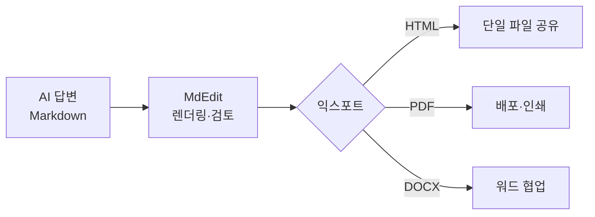

# MdEdit — AI 시대의 올인원 마크다운 에디터 (요약본)

`버전 0.6.0` · `Tauri v2 + React 18` · `macOS / Windows / Linux` · `MIT`

> *본 문서 자체도 MdEdit로 작성·렌더링·익스포트 — 도구 신뢰성의 직접 실증*

## 한 줄 요약

- AI가 쏟아내는 마크다운을 읽고·편집하고 단일 파일(HTML/PDF/DOCX)로 변환·공유하는 경량 데스크톱 앱
- 약 6개 범주 별도 도구의 작업을 플러그인 없이 단일 앱으로 통합

---

## 1. 제작 동기 및 개발 과정

### 제작 동기

- AI 시대에 마크다운·HTML 중심 문서 급증, 그러나 보고·편집·변환·공유 도구가 여러 개로 흩어져 도구 전환 비용 발생
- 마크다운 전용 뷰어 부재, AI 산출물을 가볍게 띄울 수단 없음
- VS Code는 미리보기 위해 플러그인 별도 설치·설정 필요
- 더블클릭 한 번으로 즉시 실행되는 경량 도구 요구, 편집·미리보기 동시 작업 요구
- 마크다운·HTML·코딩/설정 파일·이미지까지 한 곳에서 처리 요구, AI 답변을 렌더링·변환·공유할 마지막 단계 필요

### 개발 과정

- 누구나 부담 없이 쓰도록 경량·범용 배포 목표 설정
- 속도 중심으로 Rust(Tauri v2) 채택, 작은 단일 바이너리·낮은 메모리 확보
- 처음 다루는 언어였으나 Claude Code의 여러 기법·개발 하네스 활용으로 언어를 몰라도 아키텍처 이해 기반 최종 완성함

---

## 2. 적용한 AI 모델

- Claude Code(Anthropic의 AI 코딩 도구) 적용 + Claude Code 위에 자체 "개발 하네스" 구축이 핵심
- 하네스 구조: 요구사항을 명세(SPEC)로 구조화 → 테스트 우선 작성 → 구현 → 리팩터링을 표준 반복 사이클로 고정
- 전문화된 에이전트·스킬·규칙·검수 게이트를 조합한 일관 품질 유지, 언어 미숙에도 설계 관점 진행 가능
- 결과로 456개 테스트·E2E 회귀 검증 확보
- 앱 런타임에 AI 미내장(개발 보조에만 사용), 모델 버전 번호는 미특정

---

## 3. 개발 Tool 사용법 및 적용 방법

### 기본 사용법

- 파일/폴더 열기 — 폴더 열기 후 탐색기에서 검색·필터·생성·삭제·이름 변경 처리
- 편집 — 툴바(B/I/제목/코드/링크/목록/인용/이미지) + 단축키 `Ctrl+N`(새 문서)·`Ctrl+S`(저장)·`Ctrl+Shift+S`(다른 이름 저장), CodeMirror 6 구문 강조
- 미리보기 — 실시간 렌더링 + 뷰 모드 토글(편집/분할/미리보기) + A-/A+ 줌(제목·코드·표·이미지 동시 확대) + 스크롤 동기화
- 이미지 삽입 — `Cmd+V`(클립보드 base64 인라인 임베드)·드래그앤드롭·`Cmd+Shift+I`(파일 대화상자), 위젯으로 썸네일·alt·MIME·크기 표시
- 저장·익스포트 — HTML(self-contained 단일 파일)·PDF(페이지 나눔)·DOCX(이미지 임베드), 저장 안 한 변경 경고

> [스크린샷: 분할 뷰 — 발표자 첨부]

### 활용 시나리오

**시나리오 A — 생성형 AI 마크다운 공유**

- 생성형 AI가 출력하는 마크다운 답변을 MdEdit에 붙여 즉시 렌더링
- self-contained HTML로 익스포트, 이미지까지 박힌 단일 파일 확보
- 뷰어 없는 동료에게 단일 파일 하나만 전달, 받는 사람은 브라우저로 바로 열람

**시나리오 B — 다이어그램·수식 적극 활용**

- 생성형 AI에 Mermaid·KaTeX 활용 지시 시 해당 문법으로 산출되므로 적극 활용
- 뷰잉·검토·배포는 MdEdit 담당, 분할 뷰로 확인 후 PDF·HTML 배포

> 인라인 수식도 그대로 렌더링. 예: 가우시안 정규화 상수 $\frac{1}{\sqrt{2\pi\sigma^2}}$.

> [스크린샷: Mermaid 다이어그램 렌더링 — 발표자 첨부]

**시나리오 C — 프로젝트 파일 통합 열람**

- 폴더 열기 후 `.md`/`.html`/`.py`/`.json`/`.yaml`/`.toml` 등 코드·설정 파일을 한 앱에서 구문 강조(Shiki)로 빠르게 훑기
- 파일 종류마다 다른 앱 불필요, 뷰 모드 토글로 편집/분할/미리보기 전환

**시나리오 D — AI 생성 문서에 이미지 보강 후 배포**

- 생성형 AI 산출물에는 원하는 이미지 부재 경우 多
- 스크린샷 등 원하는 이미지를 `Cmd+V`로 빠르게 추가(base64 자동 임베드, 위젯 표시)
- DOCX/HTML 단일 파일로 배포·공유, 사내 AI 산출물을 표준 문서로 마감하는 마지막 단계까지 포함

> [스크린샷: HTML/PDF/DOCX 익스포트 결과 — 발표자 첨부]

---

## 4. 업무효율화 기여도

### 핵심 — 써야 할 도구 수 감소

- 기존 10종 이상 개별 도구 → MdEdit 1개로 통합, 정량 가치는 통합(consolidation)에서 발생

| MdEdit 기능 | 단독으로 하려면 필요한 도구(예시) |
| --- | --- |
| 마크다운 편집 + 실시간 미리보기 | Typora / Obsidian / Mark Text, 또는 VS Code + 미리보기 플러그인 |
| Mermaid 다이어그램 | Mermaid Live Editor(웹) / draw.io |
| LaTeX 수식 렌더링 | 별도 수식 뷰어 / LaTeX 편집기 |
| 코드·소스 파일 구문 강조 열람(200+ 언어) | VS Code / Sublime Text |
| HTML 파일 미리보기 | 웹 브라우저 |
| HTML 변환·배포 | pandoc / 편집기 익스포트 |
| PDF 변환 | pandoc+LaTeX / 인쇄→PDF / 워드 |
| DOCX 변환 | pandoc / MS Word |
| 이미지 붙여넣기 → 임베드 | 별도 이미지 도구 + 수동 임베드 |
| 단일 파일(self-contained) 공유 | pandoc `--self-contained` |

> 상용 도구명은 비교 예시일 뿐임. 구체적 가격은 본 문서에서 사실로 단정하지 않음. 비용 인용 시 *(공개 가격 기준, 변동 가능 — 발표자 확인)* 표기 권장.

### 경량성

- 시작 <500ms · 유휴메모리 <80MB · 바이너리 <15MB · 미리보기 300ms 디바운스 — 설계 목표치, 실측 `[발표자 입력]`

### 도입 효과 (발표자 입력)

- 사내 사용자 수: `[사내 데이터: 발표자 입력]`
- 통합으로 대체된 유료 라이선스/비용: `[발표자 입력]`
- 도구 전환 감소로 절약된 시간/문서 처리량: `[사내 데이터: 발표자 입력]`

---

## 5. 참고 사항

### 수상 포인트

- ① 재현 가능한 방법론 — 비전공(처음 다루는 Rust) 영역도 Claude Code 기반 개발 하네스로 프로덕션 완성, 사내 누구나 동일 방식으로 자기 도구 제작 가능한 확산 가능한 패턴
- ② 책임감 있는 AI 활용(품질 거버넌스) — 단순 코드 생성이 아닌 명세 우선 + TDD + 456 테스트 + E2E 회귀로 AI 생성 코드 신뢰성 확보
- ③ 실제 확산 증거 — 개인용 자작 → 사내 자발적 배포·사용(실사용자/피드백 `[발표자 입력]`)

### 기술 스택 요약

| 영역 | 사용 기술 |
| --- | --- |
| 프론트엔드 | React 18 · TypeScript 5 · Vite |
| 에디터 | CodeMirror 6 |
| 미리보기 | markdown-it 14 · Shiki 3 · Mermaid 11 · KaTeX |
| 상태 관리 | Zustand |
| 백엔드 | Rust · Tauri v2 |
| 익스포트 | HTML · PDF · DOCX(`docx`, ImageRun) |
| 테스트 | Vitest · `cargo test` · Playwright(E2E) |

### 보안 설계

- 경로 탐색 방지 · XSS 방지(미리보기 인라인 HTML 비활성화) · asset scope 열린 폴더 제한 · 이미지 10MB 제한

### 배포·라이선스

- 6종 패키지(.dmg/.exe/.msi/.deb/.rpm/.AppImage) · MIT(사내 자유 확산)

### 자기참조 실증

- 본 문서 자체도 MdEdit로 작성·렌더링·익스포트 → 도구 신뢰성의 직접 증거

---

*MdEdit · v0.6.0 · MIT License · macOS / Windows / Linux*
