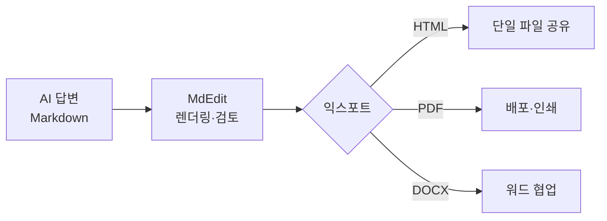

# MdEdit — AI 시대의 올인원 마크다운 에디터

> 흩어진 도구를 하나로. 마크다운 작성부터 다이어그램·수식·코드 열람, HTML/PDF/DOCX 배포까지 단일 경량 앱에서 끝낸다.

`버전 0.6.0` · `Tauri v2 + React 18` · `macOS / Windows / Linux` · `MIT License`

> *이 문서 자체가 MdEdit로 작성·렌더링되었습니다. (발표 시 MdEdit로 열어 분할 뷰·익스포트를 그대로 시연 가능 — 발표자 선택)*

---

## 한 줄 요약 (Executive Summary)

MdEdit는 AI가 쏟아내는 마크다운 문서를 **읽고, 편집하고, 그대로 공유 가능한 단일 파일(HTML/PDF/DOCX)로 변환**하는 데스크톱 앱입니다. 평소라면 편집기·다이어그램 도구·수식 뷰어·코드 뷰어·문서 변환기·이미지 도구 등 **약 6개 범주의 별도 프로그램**을 오가며 해야 할 작업을, 플러그인 설치 없이 **하나의 가벼운 앱** 안에서 완결합니다. 개발자가 개인용으로 만들어 사내에 자발적으로 배포했고, 사내 AI 도구 확산과 함께 활용 범위가 넓어지고 있습니다.

---

## 1. 제작 동기 및 개발 과정

### 1-1. 제작 동기 — 실제로 겪은 불편에서 출발했습니다

AI 도구가 일상이 되면서 업무 산출물의 상당수가 마크다운(Markdown) 형식으로 만들어집니다. 그런데 정작 이를 **편하게 읽고 다듬을 전용 도구**는 마땅치 않았습니다. 개발자가 실제로 겪은 불편은 다음과 같습니다.

- **전용 뷰어의 부재**: AI가 만들어 주는 문서는 대부분 마크다운인데, 이를 가볍게 띄워 바로 볼 수 있는 전용 뷰어가 없었습니다.
- **VS Code의 번거로움**: 코드 에디터로 열 수는 있으나, 미리보기를 보려면 플러그인을 별도로 설치·설정해야 했습니다. "그냥 보고 싶을 뿐"인데 준비 과정이 무겁습니다.
- **경량·즉시 실행에 대한 갈증**: 무겁게 켜지 않고 더블클릭 한 번으로 바로 띄워 쓸 수 있는 도구가 필요했습니다.
- **편집과 미리보기를 동시에**: 작성하면서 결과를 실시간으로 확인하고 싶었습니다.
- **여러 포맷을 한곳에서**: 마크다운뿐 아니라 HTML, 그리고 자주 쓰는 코딩·설정 파일(.py, .json, .yaml 등)까지 한 화면에서 보고 싶었습니다.
- **이미지 붙여넣기**: 스크린샷을 복사해 바로 붙여넣고 싶었지만, 대부분의 마크다운 뷰어가 이를 지원하지 않았습니다.
- **렌더링과 공유**: ChatGPT 답변이나 마크다운 문서를 보기 좋게 렌더링하고, 배포할 때는 HTML/PDF로 변환해 뷰어가 없는 동료에게도 그대로 전달하고 싶었습니다.

이 불편들은 하나하나는 사소하지만, 매일 반복되며 누적되는 **도구 전환 비용**이었습니다. MdEdit는 이 비용을 0에 가깝게 만드는 것을 목표로 출발했습니다.

### 1-2. 개발 과정 — 처음 쓰는 언어로, 규율은 타협하지 않았습니다

목표는 분명했습니다. **누구나 부담 없이 쓸 수 있는 경량·범용 배포** — 설치가 간단하고, 바이너리가 작고, 어느 OS에서나 동작하는 도구.

이 목표를 위해 개발자는 그동안 한 번도 써본 적 없는 **Rust(Tauri v2)** 를 처음으로 채택했습니다. Tauri는 작은 단일 바이너리와 낮은 메모리 사용을 얻기에 적합한 스택이지만, 그만큼 학습 곡선이 가팔랐습니다.

처음 쓰는 언어임에도 품질을 지키기 위해, 개발자는 검증된 소프트웨어 공학 방법론을 적용했습니다.

- **명세 우선(SPEC 기반) 개발**: 기능을 코드로 옮기기 전에 요구사항을 먼저 명세로 정리했습니다.
- **TDD(테스트 주도 개발)**: 테스트를 먼저 작성하고 구현으로 통과시키는 사이클을 반복했습니다.

그 결과는 숫자로 남았습니다.

| 품질 지표 | 결과 |
| --- | --- |
| 자동화 테스트 (프론트 Vitest + Rust `cargo test`) | **456개 통과** |
| E2E 회귀 테스트 (Playwright) | 핵심 사용자 흐름 검증 |
| 라이선스 | MIT (오픈, 사내 자유 사용) |

> 핵심 서사: **처음 쓰는 언어로도, 명세와 테스트라는 규율을 끝까지 지켰다.** 이 규율을 가능하게 한 동력이 다음 섹션의 AI 코딩 도구입니다.

---

## 2. 적용한 AI 모델 상세

### 2-1. 무엇을, 어디에 적용했나

MdEdit 개발에 적용한 AI는 **Claude Code**(Anthropic의 AI 코딩 도구)입니다. 적용 지점은 **앱 내부가 아니라 개발 과정**입니다.

> 명확히: MdEdit는 런타임에 AI 모델을 내장하지 않습니다. 앱 안에 챗봇이나 AI 생성 기능이 들어 있지 않습니다. AI는 **이 앱을 만드는 과정**에서 개발 보조 도구로 활용되었습니다.

개인 개발자가 **처음 쓰는 Rust로도 프로덕션 품질의 데스크톱 앱**을 완성할 수 있었던 핵심 동력이 바로 AI 코딩 도구였습니다.

### 2-2. 어떻게 적용했나 (개발 사이클)

AI 코딩 도구는 다음의 반복 사이클 전반에 함께 투입되었습니다.

```text
요구사항 → 명세(SPEC) 정리 → 테스트 먼저 작성 → 구현 → 리팩터링 → (반복)
```

- **학습 곡선 단축**: Rust/Tauri처럼 익숙하지 않은 스택의 문법·관용구·함정을 빠르게 넘어서도록 도왔습니다.
- **명세 → 테스트 → 구현**: 요구사항을 명세로 구조화하고, 테스트를 먼저 작성한 뒤 구현으로 통과시키는 흐름을 일관되게 유지했습니다.
- **품질·커버리지 유지**: 456개 테스트와 E2E 회귀 검증에 이르는 일관된 코드 품질을 지키는 데 기여했습니다.

> Claude Code는 Anthropic의 Claude 모델 계열 위에서 동작합니다. (구체적 모델 버전 번호는 본 문서에서 특정하지 않습니다.)

### 2-3. AI 시대 워크플로우와의 정합성

MdEdit 자체는 AI를 내장하지 않지만, **AI가 만든 산출물을 다루는 도구**로서 AI 시대 워크플로우에 자연스럽게 들어맞습니다. AI가 생성한 마크다운을 받아 렌더링·검토·표준화하고, 공유 가능한 형식으로 변환하는 마지막 단계를 담당합니다. (구체적 시나리오는 Section 3 참조.)

---

## 3. 개발한 Tool 사용법 및 적용 방법

### 3-1. 기본 사용법

#### (1) 설치 / 실행
- 배포 파일을 실행하거나(.dmg/.exe/.msi/.deb/.rpm/.AppImage), 앱을 띄운 뒤 **폴더 열기**로 작업 디렉터리를 엽니다.

#### (2) 파일 / 폴더 열기
- **파일 탐색기**에서 폴더를 열고, **검색·필터**로 원하는 파일을 빠르게 찾습니다.
- 생성·삭제·이름 변경, 상위 폴더 이동(`..`), 새로고침을 탐색기에서 직접 처리합니다.

#### (3) 편집
- **툴바**: 굵게(B) · 기울임(I) · 제목(H1–H3) · 코드 · 링크 · 목록 · 인용 · 이미지.
- **단축키**: `Ctrl+N`(새 문서) · `Ctrl+S`(저장) · `Ctrl+Shift+S`(다른 이름으로 저장).
- 에디터는 **CodeMirror 6** 기반으로 구문 강조를 제공합니다.

#### (4) 미리보기
- 입력과 동시에 **실시간 미리보기**(markdown-it, 300ms 디바운스).
- **뷰 모드 토글**: 편집 전용 / 분할 / 미리보기 전용 (헤더의 세그먼트 토글).
- **A- / A+ 줌**: 제목·코드·표·이미지가 비율에 맞게 함께 확대/축소.
- **스크롤 동기화**: 에디터와 미리보기가 함께 스크롤됩니다. 미리보기의 링크는 시스템 기본 브라우저에서 열립니다.

#### (5) 이미지 삽입
- **붙여넣기** `Cmd+V`: 클립보드 이미지를 base64로 인라인 임베드(기본값, File 모드로 전환 가능).
- **드래그앤드롭** 또는 파일 대화상자 `Cmd+Shift+I`.
- 삽입된 이미지는 **위젯**으로 표시되어 썸네일 · alt · MIME · 파일 크기를 한눈에 보여줍니다.

#### (6) 저장 및 익스포트
- **HTML**: 이미지가 base64로 박힌 self-contained 단일 파일.
- **PDF**: 페이지 나눔 처리 포함.
- **DOCX**: 이미지를 실제로 임베드한 워드 문서(ImageRun).
- 저장 상태 표시와 단어/글자 수 카운트를 항상 확인할 수 있고, 편집 중 다른 파일을 열면 **저장하지 않은 변경 경고**가 뜹니다.

### 3-2. 활용 시나리오별 사용법

#### 시나리오 A — ChatGPT 답변을 동료에게 공유
1. ChatGPT에 질문하고 답변을 마크다운으로 받습니다.
2. 메일/메신저로 받은 텍스트를 MdEdit에 붙여넣어 **즉시 렌더링**합니다.
3. **self-contained HTML로 익스포트**합니다.
4. 뷰어가 없는 동료에게 단일 파일 하나만 보냅니다 → 받는 사람은 **브라우저로 바로 열람**.

> 효과: 별도 변환 도구나 공유 서비스 없이, 받는 사람의 환경에 의존하지 않는 깔끔한 공유.

#### 시나리오 B — 기술 문서 한 화면 작성
1. 마크다운 본문에 **Mermaid 다이어그램**, **코드 블록(200+ 언어 강조)**, **KaTeX 수식**을 함께 작성합니다.
2. 분할 뷰에서 결과를 즉시 확인합니다.
3. **PDF로 배포**합니다.

작은 예시 (이 문서에서도 실제로 렌더링됩니다):



인라인 수식도 그대로 렌더링됩니다. 예: 가우시안 정규화 상수 $\frac{1}{\sqrt{2\pi\sigma^2}}$.

#### 시나리오 C — 프로젝트 파일 통합 열람
1. 프로젝트 **폴더 열기**.
2. `.md` / `.html` / `.py` / `.json` / `.yaml` / `.toml` 등 코드·설정 파일을 **하나의 앱에서 구문 강조**로 열람(Shiki, 읽기 전용).
3. 뷰 모드 토글로 편집/분할/미리보기를 전환하며 빠르게 훑습니다.

> 효과: 파일 종류마다 다른 앱을 켤 필요 없이, 한 창에서 프로젝트 전체를 읽습니다.

#### 시나리오 D — 이미지 포함 보고서
1. 스크린샷을 `Cmd+V`로 붙여넣습니다 → **base64 자동 임베드**(위젯으로 표시).
2. **DOCX 또는 HTML로 내보내기** → 이미지가 그대로 포함된 단일 파일 완성.
3. 그대로 공유.

> 효과: 이미지 경로가 깨지지 않는 "한 파일로 완결된" 보고서.

#### 시나리오 E — 사내 AI 도구 표준 출력 파이프라인
1. 사내 AI 도구의 마크다운 답변을 MdEdit로 받습니다.
2. **렌더링·검토·표준화**(서식 정리, 다이어그램·수식 확인)합니다.
3. **HTML/PDF로 배포**합니다.

> 효과: 사내 AI 산출물을 사람이 읽기 좋은 표준 문서로 전환하는 일관된 마지막 단계.

---

## 4. 업무효율화 기여도 (정량 지표 중심)

### 4-1. 핵심 논지 — 흩어진 도구를 하나로

위 기능들을 각각 따로 갖추려면, 보통 **여러 개의 상용/개별 프로그램을 설치하고 그 사이를 오가며** 작업해야 합니다. MdEdit는 이를 **하나의 경량 앱**으로 통합합니다. 정량적 가치는 바로 이 **통합(consolidation)** 에서 나옵니다.

### 4-2. 기능 → 별도로 쓰면 필요한 도구(예시) 대체 매핑

| MdEdit 기능 | 단독으로 하려면 필요한 도구(예시) |
| --- | --- |
| 마크다운 편집 + 실시간 미리보기 | Typora / Obsidian / Mark Text, 또는 VS Code + 미리보기 플러그인 |
| Mermaid 다이어그램 | Mermaid Live Editor(웹) / draw.io |
| LaTeX 수식 렌더링 | 별도 수식 뷰어 / LaTeX 편집기 |
| 코드·소스 파일 구문 강조 열람(200+ 언어) | VS Code / Sublime Text |
| HTML 파일 미리보기 | 웹 브라우저 |
| HTML 변환·배포 | pandoc / 편집기 익스포트 |
| PDF 변환 | pandoc+LaTeX / 인쇄→PDF / 워드 |
| DOCX 변환 | pandoc / MS Word |
| 이미지 붙여넣기 → 임베드 | 별도 이미지 도구 + 수동 임베드 |
| 단일 파일(self-contained) 공유 | pandoc `--self-contained` |

> 상용 도구명은 비교 예시일 뿐입니다. 구체적 가격은 본 문서에서 사실로 단정하지 않습니다. 비용을 인용할 경우 *(공개 가격 기준, 변동 가능 — 발표자 확인)* 으로 표기하시기 바랍니다.

### 4-3. 정량 요약 (모두 검증 가능한 수치)

| 항목 | 수치 |
| --- | --- |
| 통합되는 도구 범주 | **약 6개** (편집기 · 다이어그램 도구 · 수식 뷰어 · 코드 뷰어 · 문서 변환기 · 이미지 도구) |
| 단일 앱에서 열람 가능한 파일 형식 | **15종 이상** (md, html, py, js/mjs/cjs, ts, json, jsonl, yaml/yml, toml, sh/bash, css + Mermaid + LaTeX 수식) |
| 필요한 플러그인 설치 | **0개** (VS Code 대비 미리보기 플러그인 별도 설치·설정 불필요) |
| 코드 구문 강조 지원 언어 | **200+** (Shiki) |

#### 경량성 — 설계 목표치(measured 값 아님)

아래는 README "성능 목표" 표의 **설계 목표치**이며, 측정된 실측 결과가 아닙니다. 발표 시 실측값을 채워 주십시오.

| 지표 | 설계 목표치(measured 값 아님) | 실측치 |
| --- | --- | --- |
| 시작 시간 | < 500ms | `[실측치: 발표자 입력]` |
| 유휴 메모리 사용량 | < 80MB | `[실측치: 발표자 입력]` |
| 바이너리 크기 | < 15MB | `[실측치: 발표자 입력]` |
| 미리보기 렌더링 | 300ms 디바운스 | `[실측치: 발표자 입력]` |

#### 컨텍스트 전환 절감

"**AI 답변 → 렌더링 → 변환 → 공유**" 워크플로우 전체를 **앱 1개 안에서 완결**합니다. 도구 간 복사·이동·재포맷 단계가 사라지므로, 반복 업무에서 누적되는 전환 비용이 직접 줄어듭니다.

### 4-4. 도입 효과 (정량 보강용 — 발표자 입력)

아래는 **본 문서에 임의로 채우지 않은** 항목입니다. 사내 실데이터가 있다면 발표자가 채워 정량 근거를 보강할 수 있습니다(선택 사항이며, 없는 경우 비워 두십시오).

- 사내 사용자 수: `[사내 데이터: 발표자 입력]`
- 통합으로 대체된 유료 라이선스/비용: `[발표자 확인]`
- 도구 전환 감소로 절약된 시간/문서 처리량: `[사내 데이터: 발표자 입력]`

> 위 수치는 발표자가 직접 제공하는 값이며, 본 문서가 임의로 생성한 추정치가 아닙니다.

---

## 5. 참고 사항

### 5-1. 기술 스택 요약

| 영역 | 사용 기술 |
| --- | --- |
| 프론트엔드 | React 18 · TypeScript 5 · Vite |
| 에디터 | CodeMirror 6 |
| 미리보기 | markdown-it 14 · Shiki 3 · Mermaid 11 · KaTeX |
| 상태 관리 | Zustand |
| 백엔드 | Rust · Tauri v2 |
| 익스포트 | HTML · PDF · DOCX(`docx`, ImageRun) |
| 테스트 | Vitest · `cargo test` · Playwright(E2E) |

### 5-2. 보안 설계 (한 줄 요약)

경로 탐색 방지(`validate_path`) · XSS 방지(미리보기 내 인라인 HTML 비활성화) · 이미지 10MB 제한 · asset scope를 열린 폴더로 제한.

### 5-3. 배포 / 라이선스

- **라이선스**: MIT (사내 자유 사용·재배포 가능)
- **크로스플랫폼 배포**: `.dmg` / `.exe` / `.msi` / `.deb` / `.rpm` / `.AppImage`

### 5-4. 향후 확장 여지 (과장 없이)

현재 검증된 범위를 견고히 다진 위에서, 지원 파일 형식 확장과 익스포트 옵션 보강 등 점진적 개선의 여지가 있습니다. (현시점 기준 미구현 기능은 본 문서에서 약속하지 않습니다.)

### 5-5. 발표자 첨부 항목 (placeholder)

- `> [스크린샷: 분할 뷰 — 발표자 첨부]`
- `> [스크린샷: Mermaid 다이어그램 렌더링 — 발표자 첨부]`
- `> [스크린샷: HTML/PDF/DOCX 익스포트 결과 — 발표자 첨부]`
- 배포 링크 / 사내 채널: `[발표자 입력]`

---

*MdEdit · v0.6.0 · MIT License · macOS / Windows / Linux*
