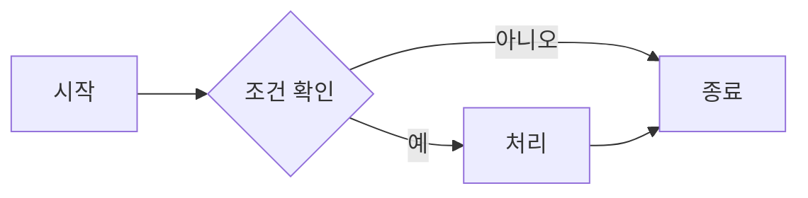
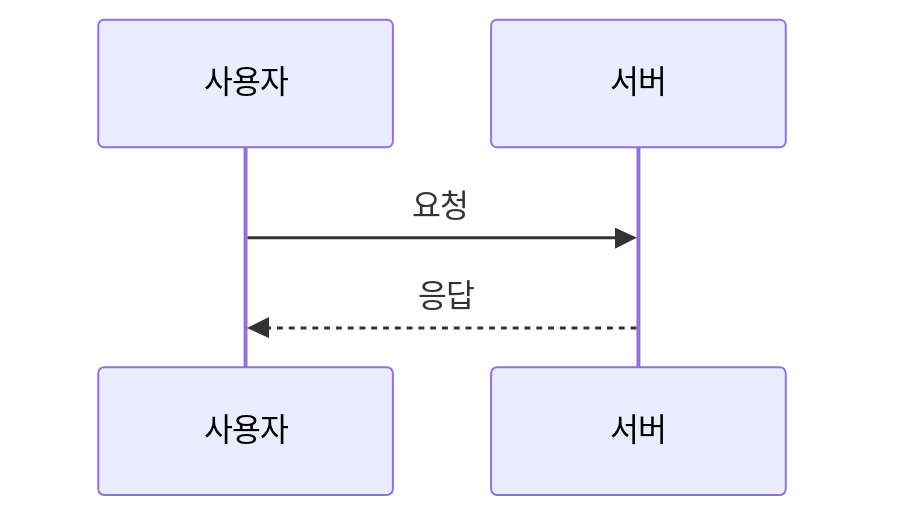
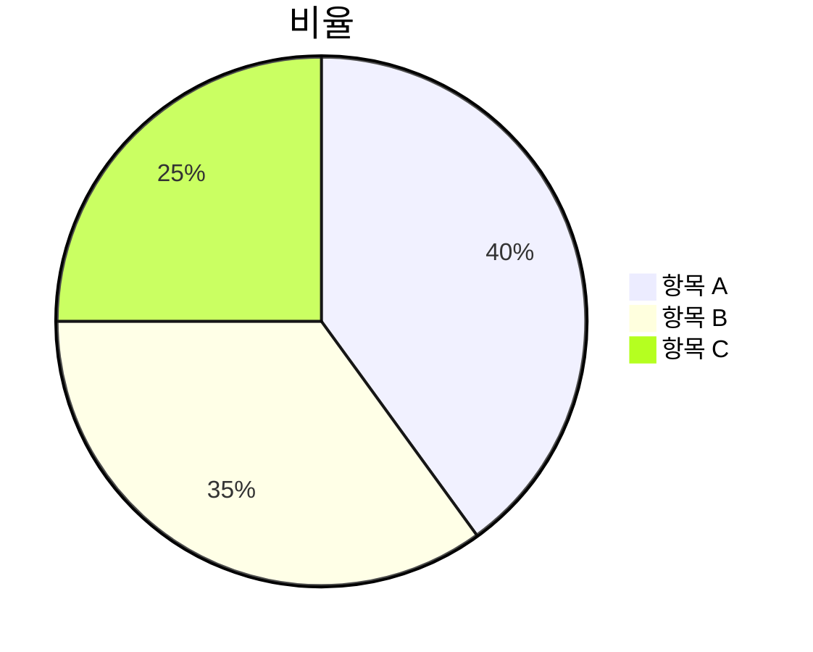

# MdEdit 사용자 매뉴얼

> **이 문서는 코딩 지식이 없는 분들도 쉽게 사용할 수 있도록 작성된 가이드입니다.**

---

## 목차

1. [MdEdit이란?](#1-mdedit이란)
2. [화면 구성 안내](#2-화면-구성-안내)
3. [기본 사용법 - 빠른 시작](#3-기본-사용법---빠른-시작)
4. [LLM 텍스트 붙여넣기 & 렌더링](#4-llm-텍스트-붙여넣기--렌더링)
5. [내보내기 (Export)](#5-내보내기-export)
6. [Mermaid 다이어그램 트러블슈팅](#6-mermaid-다이어그램-트러블슈팅)
7. [자주 쓰는 단축키](#7-자주-쓰는-단축키)

---

## 1. MdEdit이란?

MdEdit은 **마크다운(Markdown) 편집기**입니다.

**마크다운**이란, `# 제목`, `**굵게**` 같은 간단한 기호로 문서를 꾸밀 수 있는 글쓰기 방식입니다.
특히 ChatGPT, Claude 같은 **LLM(AI) 서비스가 출력하는 텍스트**가 마크다운 형식으로 되어 있는 경우가 많습니다.

**MdEdit의 주요 용도:**
- LLM 서비스에서 생성한 텍스트를 붙여넣고, 깔끔하게 렌더링된 모습을 확인
- 플로우차트(Mermaid 다이어그램) 등 시각 자료를 즉시 미리보기
- 렌더링 결과를 HTML, PDF, DOCX 파일로 내보내기

---

## 2. 화면 구성 안내

MdEdit을 열면 아래와 같이 크게 4개 영역으로 나뉩니다.

```
+----------------------------------------------------------+
|  [상단 메뉴바]  MdEdit | New  Save  Save As | Export v  |  A- 14px A+  [달/해]  |
+--------+--------------------+-------------------------+
|        |   [편집 툴바]      |                         |
|        |  B  I  H1 H2 H3   |                         |
| [파일  |  .  1. </>  " 링크|  [미리보기 창]           |
| 탐색기] |                    |  (오른쪽에 실시간으로    |
|        |   [편집 창]        |   렌더링된 결과가        |
|        |                    |   표시됩니다)            |
|        |  여기에 텍스트를   |                         |
|        |  입력합니다        |                         |
|        |                    |                         |
+--------+--------------------+-------------------------+
| [하단 상태바]  Saved | Lines: 10 | 5 words | Sync  Ln 1, Col 1  UTF-8 |
+----------------------------------------------------------+
```

### 각 영역 설명

#### ① 상단 메뉴바 (Header)

화면 맨 위의 가로 줄입니다.

| 버튼/항목 | 기능 |
|-----------|------|
| **MdEdit** | 앱 이름 표시 |
| **New** | 새 문서 만들기 |
| **Save** | 현재 파일 저장 |
| **Save As** | 다른 이름으로 저장 |
| **Export ▼** | 파일 내보내기 메뉴 (클릭하면 HTML/PDF/DOCX 선택) |
| **파일명** | 현재 열린 파일 이름 (저장 안 된 경우 주황 점 표시) |
| **A-** | 글자 크기 줄이기 |
| **14px** | 현재 글자 크기 |
| **A+** | 글자 크기 늘리기 |
| **🌙 / ☀️** | 다크 모드 / 라이트 모드 전환 |

#### ② 파일 탐색기 (왼쪽 사이드바)

왼쪽에 위치한 파일 목록 패널입니다.

- **폴더 열기**: 폴더를 선택하면 해당 폴더의 파일 목록이 표시됩니다
- **파일 클릭**: 마크다운 파일을 클릭하면 편집 창에 열립니다
- **검색**: 폴더 안에서 파일 이름으로 검색 가능

> 사이드바가 안 보인다면? 왼쪽 상단의 **☰** 버튼을 클릭하세요.

#### ③ 편집 창 (가운데)

텍스트를 입력하거나 붙여넣는 곳입니다.

**편집 툴바** (편집 창 상단 버튼들):

| 버튼 | 기능 | 예시 |
|------|------|------|
| **B** | 굵게 | `**텍스트**` |
| **I** | 기울임 | `*텍스트*` |
| **H1** | 큰 제목 | `# 제목` |
| **H2** | 중간 제목 | `## 제목` |
| **H3** | 작은 제목 | `### 제목` |
| **•** | 글머리 기호 목록 | `- 항목` |
| **1.** | 번호 목록 | `1. 항목` |
| **</>** | 코드 | `` `코드` `` |
| **"** | 인용문 | `> 인용` |
| **🔗** | 링크 삽입 | `[텍스트](주소)` |
| **🖼** | 이미지 삽입 | 파일 선택 대화상자 열림 |

#### ④ 미리보기 창 (오른쪽)

편집 창에 입력한 마크다운이 **실시간으로 렌더링**되어 표시됩니다.
마크다운 기호들이 사라지고, 실제 문서처럼 보입니다.

#### ⑤ 하단 상태바 (Footer)

| 항목 | 의미 |
|------|------|
| **Saved / Unsaved** | 현재 저장 상태 (Unsaved = 저장 안 됨) |
| **Lines** | 총 줄 수 |
| **words** | 단어 수 |
| **chars** | 글자 수 |
| **Sync** | 편집-미리보기 동기 스크롤 ON/OFF |
| **Ln / Col** | 현재 커서 위치 (줄 번호 / 열 번호) |

---

## 3. 기본 사용법 - 빠른 시작

### 3-1. 새 문서 시작하기

1. 상단 메뉴의 **New** 버튼 클릭
2. 편집 창에 내용 입력
3. **Save As** 버튼으로 파일로 저장 (처음 저장 시)

### 3-2. 기존 파일 열기

1. 왼쪽 사이드바에서 **Open Folder** 클릭
2. 마크다운 파일(`.md`)이 있는 폴더 선택
3. 파일 목록에서 원하는 파일 클릭

### 3-3. 패널 크기 조절

편집 창과 미리보기 창 사이의 **경계선을 마우스로 드래그**하면 각 패널의 크기를 조절할 수 있습니다.

---

## 4. LLM 텍스트 붙여넣기 & 렌더링

LLM 서비스(ChatGPT, Claude 등)에서 생성한 텍스트를 MdEdit에서 렌더링하는 방법입니다.

### 4-1. 순서

```
[1단계]                    [2단계]                    [3단계]
LLM 서비스에서         →   MdEdit 편집 창에       →   오른쪽 미리보기에서
텍스트 전체 복사            Ctrl+V 로 붙여넣기          렌더링 결과 확인
(Ctrl+A → Ctrl+C)
```

#### 상세 방법

**1단계: LLM 텍스트 복사**

- ChatGPT, Claude 등의 응답 창에서 텍스트 전체를 선택 (Ctrl+A 또는 마우스로 드래그)
- Ctrl+C 로 복사

**2단계: MdEdit에 붙여넣기**

- MdEdit의 편집 창(가운데 패널) 클릭
- Ctrl+V 로 붙여넣기

> **팁**: 기존 내용을 모두 지우고 붙여넣으려면, 편집 창에서 Ctrl+A 로 전체 선택 후 Ctrl+V 하면 됩니다.

**3단계: 미리보기 확인**

- 오른쪽 패널에 자동으로 렌더링된 결과가 표시됩니다
- 제목, 목록, 코드 블록, 다이어그램 등이 시각적으로 표현됩니다

### 4-2. 미리보기가 편집 창과 동시에 스크롤 되게 하기

- 하단 상태바의 **Sync** 버튼을 클릭하면 파란색으로 활성화됩니다
- 활성화되면 편집 창을 스크롤할 때 미리보기도 같이 스크롤됩니다

---

## 5. 내보내기 (Export)

렌더링된 결과를 파일로 저장하는 방법입니다.

### 5-1. 내보내기 형식

| 형식 | 특징 | 용도 |
|------|------|------|
| **HTML** | 웹 브라우저로 열 수 있는 파일 | 인터넷 공유, 웹 자료 |
| **PDF** | 어디서나 동일하게 보이는 파일 | 문서 제출, 인쇄 |
| **DOCX** | Word 문서 형식 | Word에서 추가 편집 |

### 5-2. 내보내기 방법

```
상단 메뉴의 [Export ▼] 버튼 클릭
         |
         +--> Export as HTML   (HTML 파일로 저장)
         +--> Export as PDF    (PDF 파일로 저장)
         +--> Export as DOCX   (Word 파일로 저장)
```

1. 상단 메뉴바에서 **Export ▼** 버튼 클릭
2. 원하는 형식 선택 (HTML / PDF / DOCX)
3. 저장 위치와 파일 이름 지정 후 저장

> **주의**: 내보내기 버튼은 편집 창에 내용이 있을 때만 활성화됩니다.
> 내용이 없으면 버튼이 흐릿하게 표시되며 클릭되지 않습니다.

---

## 6. Mermaid 다이어그램 트러블슈팅

LLM이 생성한 텍스트에는 **Mermaid** 형식의 다이어그램 코드가 포함될 수 있습니다.
그런데 LLM이 잘못된 문법으로 코드를 생성하는 경우, 미리보기에서 다이어그램이 렌더링되지 않고 에러 메시지 또는 빈 화면이 표시됩니다.

### Mermaid 블록이란?

마크다운에서 아래처럼 생긴 코드 블록이 Mermaid 다이어그램입니다:

````

````

### 6-1. 렌더링이 안 될 때 확인할 것들

#### 문제 1: ` ```mermaid ` 뒤에 공백이나 글자가 있는 경우

**잘못된 예시:**
````
```mermaid flowchart
    A --> B
```
````
````
```mermaid  (공백 2개)
    A --> B
```
````

**올바른 예시:**
````

````

**해결 방법**: ` ```mermaid ` 다음에는 바로 줄바꿈이 와야 합니다. 같은 줄에 다른 글자가 있으면 안 됩니다.

---

#### 문제 2: 특수문자가 포함된 경우

노드(박스) 이름에 특수문자가 들어가면 렌더링이 실패할 수 있습니다.

**잘못된 예시:**
```
flowchart LR
    A[사용자 (User)] --> B[서버 (Server)]
    B --> C["결과: 200 OK"]
```

**해결 방법**: 특수문자 `(`, `)`, `:`, `"` 등이 들어간 레이블은 큰따옴표로 감쌉니다:
```
flowchart LR
    A["사용자 (User)"] --> B["서버 (Server)"]
    B --> C["결과: 200 OK"]
```

---

#### 문제 3: 들여쓰기에 탭(Tab) 대신 공백이 섞인 경우

LLM이 탭 문자 대신 이상한 공백을 넣는 경우가 있습니다.

**해결 방법**: 들여쓰기는 **스페이스 4칸** 또는 **탭 1개**로 통일합니다.
편집 창에서 문제가 되는 줄의 들여쓰기를 지우고 다시 입력하세요.

---

#### 문제 4: 다이어그램 유형 키워드 오타

Mermaid는 다이어그램 종류를 첫 줄에 명시해야 합니다.

| 다이어그램 종류 | 올바른 키워드 |
|-----------------|---------------|
| 순서도 | `flowchart LR` 또는 `flowchart TD` |
| 시퀀스 다이어그램 | `sequenceDiagram` |
| 클래스 다이어그램 | `classDiagram` |
| 간트 차트 | `gantt` |
| 파이 차트 | `pie` |

**LR** = 왼쪽에서 오른쪽, **TD** = 위에서 아래

---

#### 문제 5: 화살표 문법 오류

Mermaid에서 연결선(화살표)은 정해진 기호를 사용해야 합니다.

| 종류 | 올바른 기호 | 잘못된 예 |
|------|-------------|-----------|
| 일반 화살표 | `-->` | `->`, `-->`(공백 있음) |
| 실선 | `---` | `-`, `--` |
| 점선 화살표 | `-.->` | `..->` |

---

### 6-2. 빠른 수정 방법 (단계별)

다이어그램이 렌더링되지 않을 때 아래 순서대로 확인하세요:

```
[Step 1] ```mermaid 줄 확인
         - 줄 끝에 공백이나 다른 문자가 없는지 확인
         - 대소문자가 정확한지 확인 (mermaid, flowchart 등은 소문자)

         [Step 2] 첫 번째 키워드 줄 확인
         - flowchart LR / flowchart TD / sequenceDiagram 등
         - 오타가 없는지 확인

         [Step 3] 특수문자 확인
         - 노드 레이블에 괄호, 콜론 등이 있으면 큰따옴표로 감싸기

         [Step 4] 화살표 기호 확인
         - --> 에 공백이 포함되지 않았는지 확인

         [Step 5] 닫는 ``` 확인
         - 다이어그램 끝에 ``` 가 단독 줄로 있는지 확인
```

### 6-3. 올바른 Mermaid 예시 모음

**순서도 (Flowchart)**:
````

````

**시퀀스 다이어그램**:
````

````

**파이 차트**:
````

````

---

## 7. 자주 쓰는 단축키

| 단축키 | 기능 |
|--------|------|
| **Ctrl + N** | 새 문서 |
| **Ctrl + S** | 저장 |
| **Ctrl + Shift + S** | 다른 이름으로 저장 |
| **Ctrl + B** | 굵게 (**선택한 텍스트**) |
| **Ctrl + I** | 기울임 (*선택한 텍스트*) |
| **Ctrl + A** | 전체 선택 |
| **Ctrl + Z** | 실행 취소 |
| **Ctrl + Y** | 다시 실행 |

> Mac 사용자는 **Ctrl** 대신 **Cmd(Command)** 키를 사용하세요.

---

## 자주 묻는 질문 (FAQ)

**Q. 미리보기 창이 보이지 않아요.**

A. 편집 창과 미리보기 창 사이의 경계선을 오른쪽으로 드래그해 보세요. 또는 사이드바 경계선이 너무 오른쪽에 있으면 왼쪽으로 드래그하세요.

---

**Q. Export 버튼이 클릭되지 않아요.**

A. 편집 창에 내용이 있어야 Export 버튼이 활성화됩니다. 내용을 붙여넣은 후 시도해 보세요.

---

**Q. 저장 후 파일을 어디서 찾나요?**

A. Save As를 클릭하면 저장 위치를 직접 지정할 수 있습니다. 지정한 폴더에 파일이 저장됩니다.

---

**Q. 다크 모드로 바꾸고 싶어요.**

A. 상단 메뉴바 오른쪽의 **🌙** 버튼을 클릭하면 다크 모드로, **☀️** 버튼을 클릭하면 라이트 모드로 전환됩니다.

---

**Q. Mermaid 다이어그램이 아예 표시되지 않고 빈 공간만 보여요.**

A. 6번 트러블슈팅 섹션을 참고하여 코드 블록 문법을 점검하세요. 가장 흔한 원인은 ` ```mermaid ` 뒤에 공백이 있거나, 노드 레이블에 특수문자가 있는 경우입니다.

---

*MdEdit 사용자 매뉴얼 | 비개발자용*
