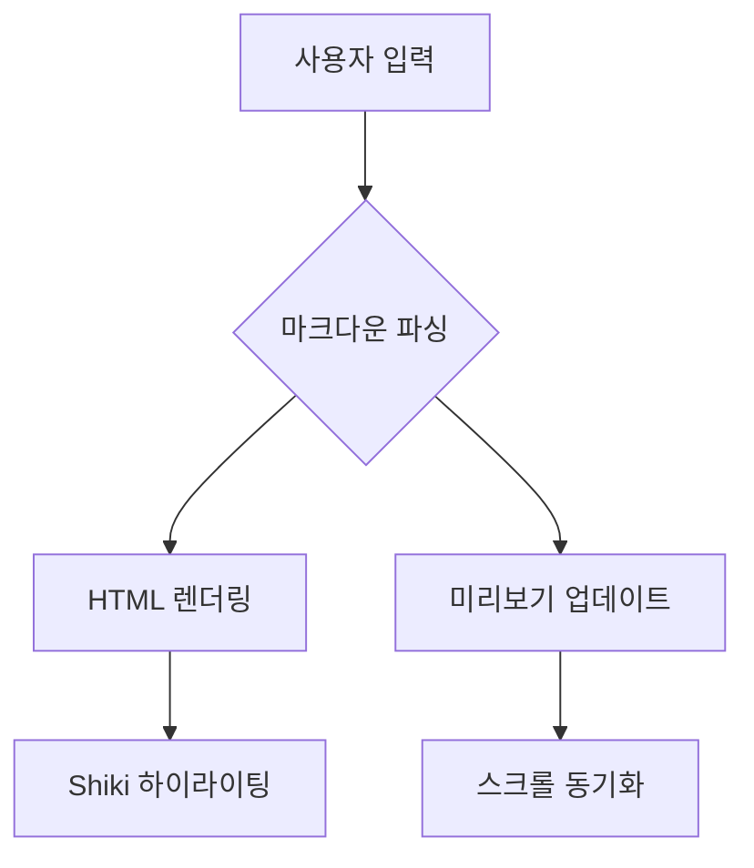

# E2E 테스트 픽스처

이 파일은 Playwright E2E 테스트를 위한 마크다운 픽스처입니다.

## 가로 스크롤 테이블

| 이름 | 나이 | 직업 | 회사명 전체 | 소속 부서 | 이메일 연락처 | 입사일 | 근무 위치 | 직급 등급 | 재직 상태 비고 |
|------|------|------|-------------|-----------|---------------|--------|-----------|-----------|---------------|
| 홍길동 | 30 | 소프트웨어 엔지니어 | ACME Corporation Ltd. | 백엔드 개발팀 전체 | hong.gildong@example.com | 2020-01-15 | 서울특별시 강남구 테헤란로 | Senior Engineer | 정규직 재직 중 |
| 김철수 | 25 | UI/UX 디자이너 | Beta Company Korea | 프로덕트 디자인 팀 | kim.cheolsu@example.com | 2022-03-20 | 부산광역시 해운대구 센텀시티 | Junior Designer | 정규직 재직 중 |
| 이영희 | 35 | 프로젝트 매니저 | Gamma Solutions Inc. | 프로젝트 관리 본부 | lee.younghee@example.com | 2018-06-01 | 경기도 성남시 분당구 판교 | Lead Manager | 정규직 재직 중 |

## Mermaid 다이어그램



## 긴 코드 블록

```typescript
const veryLongFunctionNameForTestingHorizontalScrollBehavior = (param1: string, param2: number, param3: boolean): Promise<{ result: string; count: number }> => Promise.resolve({ result: param1, count: param2 });
```
