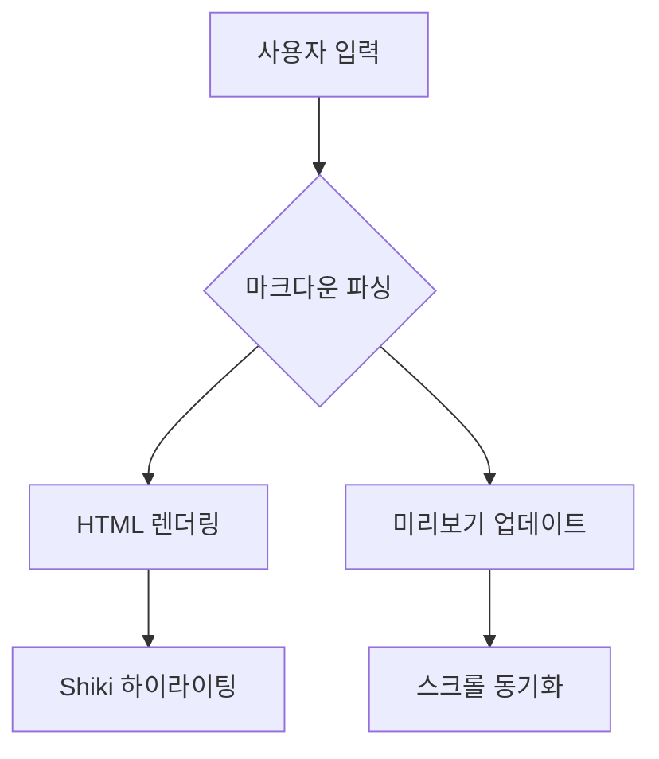

# E2E 테스트 픽스처

이 파일은 Playwright E2E 테스트를 위한 마크다운 픽스처입니다.

## 가로 스크롤 테이블

| 이름 | 나이 | 직업 | 회사명 전체 | 소속 부서 | 이메일 연락처 | 입사일 | 근무 위치 | 직급 등급 | 재직 상태 비고 |
|------|------|------|-------------|-----------|---------------|--------|-----------|-----------|---------------|
| 홍길동 | 30 | 소프트웨어 엔지니어 | ACME Corporation Ltd. | 백엔드 개발팀 전체 | hong.gildong@example.com | 2020-01-15 | 서울특별시 강남구 테헤란로 | Senior Engineer | 정규직 재직 중 |
| 김철수 | 25 | UI/UX 디자이너 | Beta Company Korea | 프로덕트 디자인 팀 | kim.cheolsu@example.com | 2022-03-20 | 부산광역시 해운대구 센텀시티 | Junior Designer | 정규직 재직 중 |
| 이영희 | 35 | 프로젝트 매니저 | Gamma Solutions Inc. | 프로젝트 관리 본부 | lee.younghee@example.com | 2018-06-01 | 경기도 성남시 분당구 판교 | Lead Manager | 정규직 재직 중 |

## Mermaid 다이어그램


```mermaid
graph TD
  A[사용자 입력] --> B{마크다운 파싱}
  B --> C[HTML 렌더링]
  B --> D[미리보기 업데이트]
  C --> E[Shiki 하이라이팅]
  D --> F[스크롤 동기화]
```

## 긴 코드 블록

```typescript
const veryLongFunctionNameForTestingHorizontalScrollBehavior = (param1: string, param2: number, param3: boolean): Promise<{ result: string; count: number }> => Promise.resolve({ result: param1, count: param2 });
```

## 리스트 렌더링 테스트 (SPEC-PREVIEW-011)

### Tight 목록

- tight 항목 1
- tight 항목 2
- tight 항목 3

### Loose 목록

- loose 항목 1

- loose 항목 2

- loose 항목 3

### Loose 순서 목록

1. loose 순서 항목 1

2. loose 순서 항목 2

3. loose 순서 항목 3

### 중첩 목록

- 부모 항목 1
  - 자식 항목 1-1
  - 자식 항목 1-2
- 부모 항목 2
  1. 자식 순서 항목 2-1
  2. 자식 순서 항목 2-2

### 태스크 표기 목록

- [x] 완료된 작업
- [ ] 미완료 작업
- 일반 항목

### 다문단 항목

- 다문단 항목의 첫 번째 문단입니다.

  다문단 항목의 두 번째 문단입니다. 여러 문단으로 구성된 리스트 항목의 문단 간 간격이 유지되는지 확인합니다.

### 긴 줄바꿈 항목

- 이 리스트 항목은 뷰포트 폭 안에서 반드시 두 줄 이상으로 줄바꿈되어야 하는 아주 긴 문장을 담고 있습니다. 행잉 인덴트가 올바르게 적용되면 줄바꿈된 두 번째 줄 이후의 텍스트도 첫 번째 줄과 동일한 좌측 정렬선에서 시작해야 하며, 마커 아래쪽으로 흘러내리듯 들여써지면 안 됩니다. 이 문장은 그 조건을 검증하기 위해 충분히 길게 작성되었습니다.
